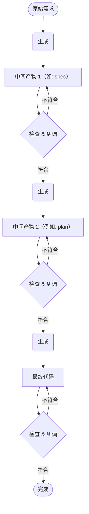

<!--
markmeta_author: titlwind
markmeta_date: 2026-01-05
markmeta_title: AI 开发经验 2025
markmeta_categories: ai
markmeta_tags: ai,claude-code
-->

# 我的 AI 开发经验 2025


## 1. 基本认知

现在是2025年刚结束, 来到2026年, 首先说明 **当下** 我对AI编码的一些基本认知。

1. 现在国内外头部厂家的大语言模型，在编码领域已经非常优秀，但仍存在差距；
2. 上下文工程是在有限的上下文里构造一个让模型持续做出正确决策的“认知环境”；
3. AI 编码工具本质上是一个Agent, 大模型能力和上下文工程能力决定了Agent的能力；
4. AI 没有生成符合期望代码, 主要原因是没有提供清晰的需求；
5. 很难给 AI 提供极其精确的需求, 主要是人类需求本身是概括的、局部的、易变的、不明确的，人类很多时候是走一步看一步；

所以要使用AI最大化提升开发效率和质量, 建议：
1. 选择头部模型；
2. 选择头部编码Agent；
3. 尽量明确好偏好和需求


## 2. AI 编码的2个方向

AI 已经让编程不再是工程师的专利, 而是变成了一个任何人都能用的工具。
AI编码工具根据不同客户群体或不同需求有比较明显的2个发展方向： **代码低关注度方向**, **代码高关注度方向**：

| 对比维度 | **代码低关注度方向** | **代码高关注度方向** |
| :--- | :--- | :--- |
| **典型场景** | 个人网站、活动页面、简单原型、小型工具 | 企业级应用、复杂系统重构、架构优化、代码库维护 |
| **对用户要求** | 创意与产品思维，无需编程知识 | 深厚的编程与架构知识，以精确描述需求、审核与优化AI输出 |
| **技术目标** | **降低门槛**,从想法到产品一站式生成 | **提升效能与控制力**：将AI作为可调度、可协作的智能体，处理工程级任务 |
| **核心范式** | **氛围编程**,快速完成简单应用 | **规约编程**：基于规范，开发复杂系统 |
| **交互方式** | 自然语言描述、上传草图、对话修改 | 在专业IDE中深度集成，支持复杂指令、智能体调度与代码可视化审查 |

> 注: 经常有人争论『一句话生成APP』是否是正确的AI编码模式，我个人认为只是不同的需求场景，没有绝对的正确或错误。而且随着AI能力的提升，未来大多数场景都可能是正确的。

市面上一些工具通常能完成 `对话 -> 代码生成 -> 预览 -> 一键上线`，如 `Bolt.new`, `v0.dev`, `Lovable`, `Replit Agent`, `Create.xyz` 等。
当然现在的大多AI编码工具结合MCP也可以完成一键生成、一键部署，但接下来，我讲的主要是 **代码高关注度方向** 的开发模式。


## 3. 基本思路

从 原始需求 到 代码 有着巨大的鸿沟, 要想得到期望的产出，需要把握生成代码的方向不要偏离。

基本思路是：
1. **提供给AI足够完整、清晰的背景知识，让决策范围收敛**
2. **从原始需求到代码中间插入多个阶段中间产物，并对中间产物进行检查和纠偏。**





## 4. 完整、清晰的背景知识

**完整意味着包含所有必要的信息，清晰意味着信息之间没有冲突、没有歧义。**

背景知识包括：
1. 产品介绍
2. 技术栈
3. 架构和模式
4. 模块结构
5. 代码规范
6. 原则
7. 约定偏好

有些信息是动态变化的，需要及时进行更新。


## 5. 多阶段中间产物

常见的中间产物：
```
原始需求 --> 代码（vibe coding）
原始需求 --> Plan --> 代码 (Plan模式)
原始需求 --> 测试用例 --> 代码 （TDD）
原始需求 --> Spec --> Plan --> Task --> 代码 (SDD)
原始需求 --> 用户故事 --> 技术设计 --> 代码
```

基本逻辑：
1. **足够小的需求（如方法级别）, 使用 vibe coding 即可；**
2. **原始需求越大，就越需要更多的中间产物来纠偏；**


## 6. Claude Code 

### 6.1. Claude Code 背景知识

通过项目根目录下的 `CLAUDE.md` 定义, 如果没有定义，可以通过 `/init` 命令让claude code 去分析代码生成，生成后做好做检查和修改。**后续有新的规范性背景知识产生的时候，需要及时沉淀到 CLAUDE.md 中。**

### 6.2. Claude Code 中间产物

Claude Code 的中间产物就是 plan 计划内容, 通过 plan 模式生成执行计划，计划中实际上包含需求、设计、修改范围等信息, 已经能满足我绝大部分需求。plan 文件一般会存放在 `~/.claude/plans`.

Claude Code 生成的 plan（计划）通常包含以下几个主要部分：
1. **任务理解 (Task Understanding)**: 说明 Claude 对用户请求的理解，包括：要实现的核心功能，预期的输出结果，涉及的技术栈或工具
2. **当前状态分析 (Current State Analysis)**: 评估项目的现有情况, 包括: 已存在的文件和代码结构,相关依赖或配置,需要修改的部分
3. **实施步骤 (Implementation Steps)**: 详细的执行计划，通常按顺序列出：需要创建或修改的文件,每个步骤的具体操作,代码实现的逻辑顺序,可能需要的测试或验证步骤
4. **技术考虑 (Technical Considerations)**: 说明实现过程中的技术决策， 包括：选择特定方案的原因,潜在的挑战或注意事项,最佳实践的应用
5. **验证方法 (Verification)**: 如何确认任务完成， 包括：测试步骤,预期的输出或行为,可能的边界情况


## 7. SDD (Spec-Driven Development)

规范驱动开发 (Spec-Driven Development, SDD) 是一种软件开发方法，首先需要创建一份详细、清晰且可执行的规范文档，这份文档定义了要构建什么以及为什么构建。然后，这份规范将驱动技术规划、任务分解和最终的代码实现。

> 说明: 市面上包括 SpecKit、claude-code-spec-workflow等方案。

`SpecKit` 是 GitHub 推出的spec开源工具包，提供了一系列命令行工具和模板，与 Cursor、Claude Code、Gemini CLI 等 AI 编码工具深度集成。它包含四阶段核心工作流和一些辅助命令。

**定义背景知识**
- `/speckit.constitution`: 定义项目的核心原则和开发规范，位于 `.specify/memory/constitution.md`

**核心工作流及中间产物**
- `/speckit.specify`: 将功能需求转化为清晰的规范文档。
- `/speckit.plan`: 制定功能的技术实现方案。
- `/speckit.tasks`: 将技术方案分解为可执行的任务清单。
- `/speckit.implement`: 按任务清单逐步实现功能代码。

每一个spec一个目录 `specs/123-xxx`, 形如:
```
.
└── 001-chat-message-limit
    ├── checklists
    │   └── requirements.md
    ├── contracts
    │   └── chatting-api-changes.yml
    ├── data-model.md
    ├── IMPLEMENTATION_SUMMARY.md
    ├── plan.md
    ├── quickstart.md
    ├── research.md
    └── spec.md
```

**辅助命令**
- `/speckit.clarify`: 解决规范中的模糊和歧义问题（可选, plan之前）
- `/speckit.checklist`: 生成需求质量验证清单（可选, plan之后）
- `/speckit.analyze`: 检查规范、计划、任务的一致性（可选, task之后, implement之前）


## 8. 使用 SDD 的感受

目前的 SpecKit、claude-code-spec-workflow 等方案, 本质是一套软件工程实践的模板和工作流，通过标准化流程，减少AI编码过程中的错误和不一致性，提高开发效率和代码质量。

但是：
- `费钱`: 每一个步骤都会按照模板进行完整分析, 按照 constitution 进行完整检查，消耗的Token也是成倍增加, specify、plan、task 阶段都触发了 claude code 限流；
- `费时`: 整个中间过程速度很慢，加上限流，一整天没有完成一个任务；
- `过于复杂审查困难`: 生成太多模板内容，太多细节，没办法一一阅读，审核起来太困难。
- `Spec仍然是中间产物`: 相关SDD的框架宣扬spec是代码蓝图是核心资产，代码只是下游附属产物。这个观点我是不认可的，spec仍然是中间产物，类似 git comment 一样的东西，可以用来追溯用，只能通过spec来了解项目演进过程，如果要了解项目全貌，从代码来得更直接。

我想将 SDD 应用于大任务，但一个大任务有太多要考虑的细节，人的心智负担太大，很难完成审核，过程中存在很多返工的情况,就会逐渐失去耐心。

我觉得 SDD 比较有用的是 `/speckit.constitution` , 它定义了项目的核心原则和开发规范，可借助其完善 CLAUDE.md. 


## 9. 我的开发模式

1. 定义并不断完善背景知识(CLAUDE.md)
2. 人工拆分出的需求任务
    1) 模块级别 (一般是基础功能)
    2) 页面级别 (有完整的API定义)
    3) API级别
    4) 单个功能级别
3. 整理需求
4. 使用 plan 模式输出执行计划并审核修改
5. 生成代码
6. 微调

需求内容要整理到什么程度呢？ 原则是：**告诉AI足够的信息，不要让AI猜**。

我的判断标准是问自己一个问题： `把 AI 当做一个能力很强的外包，已有项目背景知识 加上 告知他的需求内容, 是否足够让AI完成任务？` 如果我认为不够，则会尽量补充更多信息。

当然，你自己需要先搞清楚自己需要什么。

Spec 不适合我现在的项目，我想还有一个原因，我整理需求时，需求不仅包括要的结果，还有一些设计细节和一些偏好要求。 AI 只需要分析拆解列出它的理解让我确认，而不是传统模板化的死板详细列出 PRD,Design，Task 等。 

目前我使用的 Claude Code 和 Trae Solo 的 plan 模式都能输出比较简洁扼要的内容。
另外，plan 模式有一个 clarify 的环节，它针对可能存在歧义或理解偏差的地方，会列出来让你确认。
而目前使用Spec工具是没有这个功能。


## 10. 前端页面开发实践

我得前端代码不熟悉，处于大概能看懂的程度。 AI 前端编码能力已经非常强大，如果对样式细节没有太大的要求，前端页面开发可以交给 AI 完成。

我的项目需要有一个后台管理系统，但缺少前端，基于以下考虑我决定用AI来开发：
1. 我对后台的样式没有特殊要求；
2. 前端也不用考虑安全，全部交给后端处理； 
3. 后端 API 定义好后，AI 拥有比较完整的信息来创建页面；

关于前端方案：
1. `采用非编译型页面`： 后台前端没有什么需要保密的，同时产生了问题，需要方便AI分析定位，直接部署AI生成的页面，所见即所得。
2. `采用数据驱动型框架`： 数据驱动型框架让页面更简单灵活, 选择了熟悉的 Vue 3, Element Plus 来开发。
3. `采用组件化开发`： 组件化开发让页面更易于维护和扩展，每个组件都有自己的状态和逻辑；

前端项目结构:
```
.
├── app.js
├── assets
│   └── css
│       ├── base.css
│       └── layout.css
├── index.html
├── layout
│   ├── AdminLayout.html
│   └── AdminLayout.js
├── router
│   └── index.js
├── singles
│   ├── agents.html
│   ├── centrifugo.html
│   └── index.css
├── store
│   └── index.js
├── utils
│   ├── apiUtils.js
│   ├── authUtils.js
│   ├── componentFactory.js
│   ├── cssLoader.js
│   ├── dateUtils.js
│   ├── keyvalue.js
│   └── templateLoader.js
└── views
    ├── activities
    │   ├── activity-reward
    │   │   ├── ActivityReward.css
    │   │   ├── ActivityReward.html
    │   │   └── ActivityReward.js
    │   └── activity-service-order
    │       ├── ActivityServiceOrder.css
    │       ├── ActivityServiceOrder.html
    │       └── ActivityServiceOrder.js
    ├── area
    │   ├── comhotreq
    │   │   ├── CommunityHotRequirementManagement.css
    │   │   ├── CommunityHotRequirementManagement.html
    │   │   └── CommunityHotRequirementManagement.js
    │   └── community
    │       ├── CommunityGeoFence.css
    │       ├── CommunityGeoFence.html
    │       └── CommunityGeoFence.js
```

开发一个新页面的提示词范本：
```
请根据 xxxmapi.yml openapi 定义, 开发一个页面 static/views/<group>/<module>，包括功能 搜索、列表展示、详情、新增、编辑、删除。详情、新增、编辑、删除 分别点击按钮弹框进行操作。
```

页面修改提示词范本：
```
请根据 /mapi/<module>/<action> openapi 定义, 修改 static/views/<group>/<module>，增加审核按钮，点击后弹窗进行审核，用户在页面选择 同意 或 拒绝， 输入审核理由， 二次确认收提交审核。
```


## 11. Agent 自动化

2025 年是 AI Agent 元年， Agent 已经融入到各行各业提升生产效率。

Claude Code 本身就是一个 Agent，除了用它来编码外，还可以用它来做一些自动化任务。

```bash
claude --print --dangerously-skip-permissions "$PROMPT"
```

> 注: 购买 anthropic api 或 使用deepseek https://api-docs.deepseek.com/zh-cn/guides/anthropic_api

现在很多网站做了很多机制防止网页内容被抓取，让用户必须到网站才能查看。
但有了AI，可以模拟用户行为，去抓取网页内容并分析。
我就可以用 cladue code 去做一个定时任务，定时去抓去网页内容并分析，获取最新内容，推送给我。

可以给calude code 安装上 mcp, skills 等插件，扩展他的能力。 
只要敢于想象，AI 可以做的事情远不止于此。

推荐一些MCP:
- chrome-devtools-mcp: 控制和检查 Chrome 浏览器
- github: GitHub 仓库操作 (Issue, PR, Commit)
- postgres: PostgreSQL 数据库操作
- sqlite: 数据库操作

官方 Skills:
- **document-skills**: 文档处理核心能力 (Word, Excel, PPT, PDF)
- **agent-sdk-dev**: Agent SDK 开发工具包

社区精选 Skills:
- **ui-designer**: UI/UX 设计专家，快速构建设计系统


## 12. 对未来AI的展望

### 12.1. 代码不关注方向的AI编程模式是未来

我在最开始的时候强调我讨论的都是 `代码高关注度方向` 的AI编程模式，但未来发展方向我觉得是 `代码不关注方向` 的AI编程模式。
现在有很多人有这样的一个观点， 当前这个信息世界，除了底层长期不变的网络和操作系统， 是由大量胶水代码构成的。
我们开发的内容大多是胶水代码，只需要满足以下条件，AI 完全可以交付高质量的内容：
- 有足够的背景知识
- 有清晰明确的规范
- 有标准的运行环境


### 12.2. 原生 Spec 会极大提升效率

目前我使用的 Spec 工具本质还是一套通用的提示词和工作流，没办法根据具体的业务场景进行动态调整和变通，所以效果不是很好。
但 Spec 的方向是正确的，就是通过中间层降低歧义，让决策收敛。

> 注: Kiro、CodeBuddy 目前已宣称原生支持Spec, 但我目前还没有使用，具体效果还不太清楚。


### 12.3. Online Learning 加快 "AI 工程师" 真正落地

现在的 LLM/Agent 已经非常强大，但是仍然需要人参与。
人参与的一个重要环节就是 `Online Learning`， 就是通过与用户的交互，不断学习用户的需求和行为，从而提升模型的性能。

支持 Online Learning 的模型将不断学习和进化，让 AI 能从 实习生 到 行业专家。


### 12.4. 未来的职业？

每当新的生产力工具出现时，会剥脱掉大部分人的工作，也会创造新的工作岗位。
未来 AI 已经不需要人类去教它做什么了，他们已经能够做得比人类好。
我唯一想到的是一个岗位『AI监督员/AI审查员』，专门监督和评估 AI 做的事情是否符合规范和标准，是否有在做坏事，一旦发现就"保修"或"销毁"。


