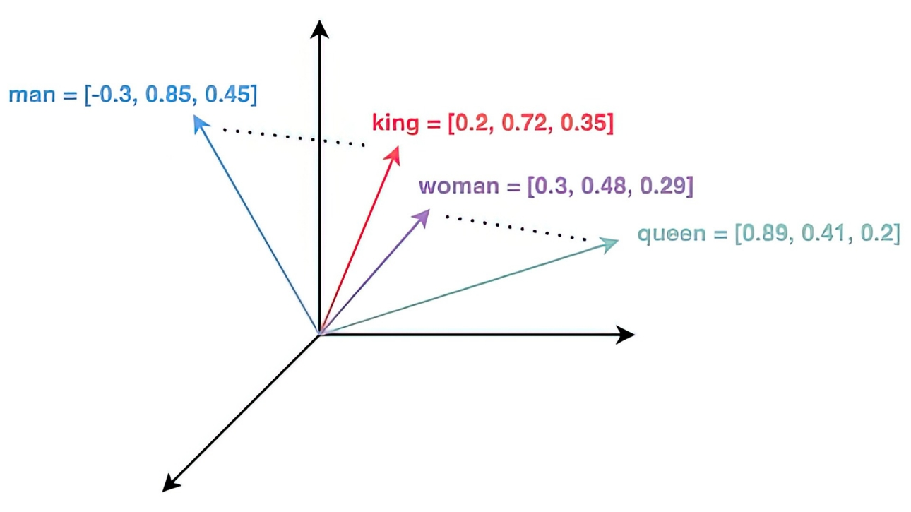
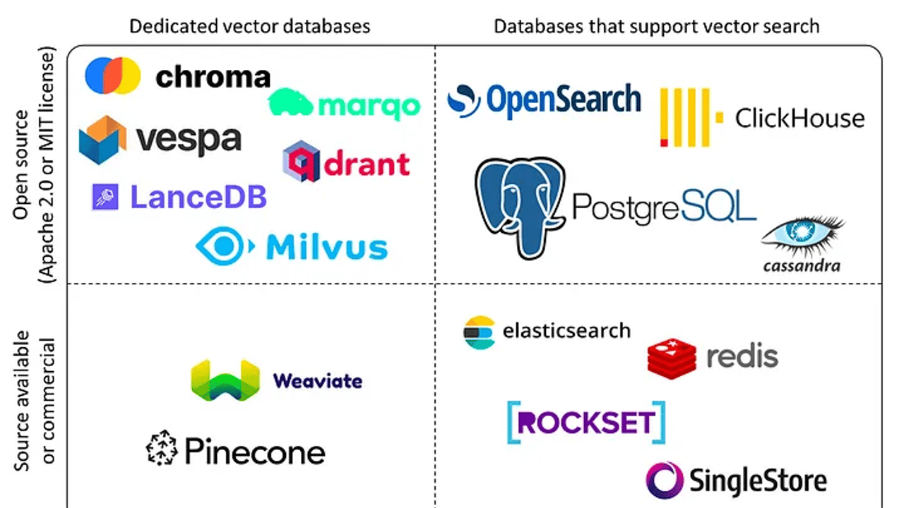
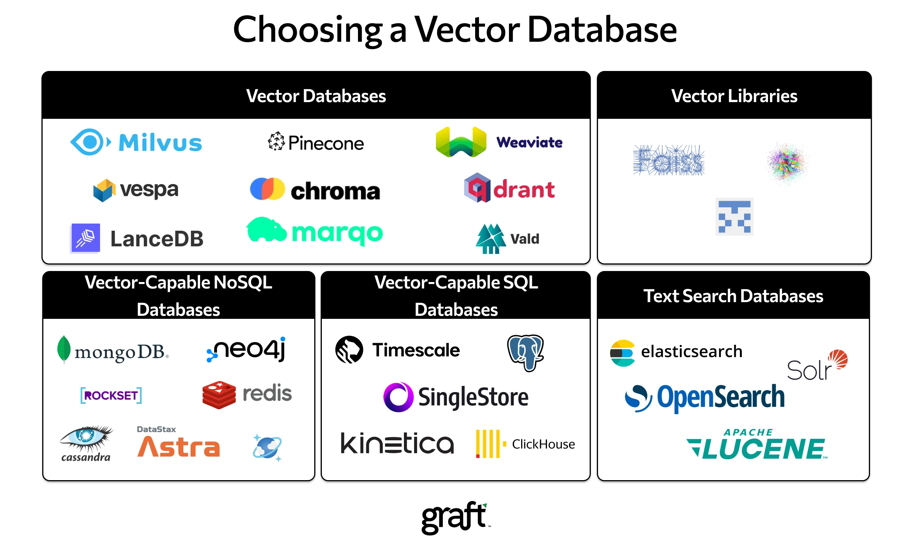

<!---
markmeta_author: titlwind
markmeta_date: 2025-02-26
markmeta_title: 向量数据库
markmeta_categories: ai
markmeta_tags: ai,vector,database
-->


# 向量数据库

> 注意: 部分内容来自AI生成，可能存在错误，如有发现，欢迎指正！

---

## **1. 向量基础概念**

### 1.1 什么是向量？
- **定义**：向量是数学中表示大小和方向的量，在计算机科学中通常表现为有序的数字列表。
- **物理意义**：可以表示速度、位移、力等有方向的量。
- **计算机中的表示**：`[v₁, v₂, ..., vₙ]`，例如 `[3, -2, 5]` 是一个三维向量。

### 1.2 向量的维度
- **二维向量**：平面中的点，如 `[2, 3]` 表示横坐标2，纵坐标3。
- **三维向量**：空间中的点，如 `[1, 4, -1]`。
- **高维向量**：机器学习中的特征向量，如 `[0.2, -0.5, 0.7, ..., 0.1]`（可能上千维）。

### 1.3. 向量的关键属性
- **长度（模）**：向量的大小，如向量 `[3, 4]` 的长度是 `√(3²+4²)=5`。
- **方向**：由各分量的比值决定，如 `[1, 2]` 和 `[2, 4]` 方向相同。

---

## **2. 向量运算**

### 2.1. 向量加减法
- **规则**：对应分量相加减。
- **范例**：
```python
  a = [1, 2, 3]
  b = [4, 5, 6]
  a + b = [1+4, 2+5, 3+6] = [5, 7, 9]
  ```

### 2.2. 标量乘法
- **规则**：每个分量乘以标量。
- **范例**：
```python
  a = [2, -1]
  k = 3
  k*a = [6, -3]
  ```

### 2.3. 点积（内积）
- **公式**：
$$\mathbf{a} \cdot \mathbf{b} = \sum_{i=1}^n a_i \cdot b_i = a_1b_1 + a_2b_2 + \dots + a_nb_n$$
- **几何意义**：反映两个向量的方向相似性，常用于计算相似度（如余弦相似度）
- **范例**：
```python
import numpy as np

a = np.array([1, 2, 3])  # 三维向量
b = np.array([4, 5, 6])  # 三维向量

dot_product = np.dot(a, b)
print(dot_product)  # 输出：1*4 + 2*5 + 3*6 = 32
  ```


### **2.4. 外积（Outer Product）**

- **定义**: 两个向量的外积生成一个**矩阵**，矩阵的第 \(i\) 行第 \(j\) 列元素是第一个向量的第 \(i\) 个分量与第二个向量的第 \(j\) 个分量的乘积。
- **公式**： 如果 $\mathbf{a}$ 是 $m$ 维向量， $\mathbf{b}$ 是 $n$ 维向量，则外积结果为 $m \times n$ 的矩阵：
```math
\mathbf{a} \otimes \mathbf{b} = 
\begin{bmatrix}
a_1b_1 & a_1b_2 & \dots & a_1b_n \\
a_2b_1 & a_2b_2 & \dots & a_2b_n \\
\vdots & \vdots & \ddots & \vdots \\
a_mb_1 & a_mb_2 & \dots & a_mb_n
\end{bmatrix}
```

- **条件**: 无维度限制，任意两个向量均可计算外积。
- **示例**: 

```python
import numpy as np

a = np.array([1, 2, 3])  # 三维向量
b = np.array([4, 5])     # 二维向量

outer_product = np.outer(a, b)
print(outer_product)
# 输出：
# [[ 4  5]
#  [ 8 10]
#  [12 15]]
```

- **外积应用场景**:
  - **矩阵生成**：用于构造低秩矩阵（如特征分解）。
  - **机器学习**：某些特征交叉场景（如分解机模型）。


### **2.5. 逐元素乘法（Element-wise Multiplication）**

- **定义**: 两个向量的对应分量相乘，生成一个新的**同维度向量**。
- **公式**：  
  \[
  \mathbf{a} \odot \mathbf{b} = [a_1b_1, a_2b_2, \dots, a_nb_n]
  \]

- **条件**: 两个向量必须**维度相同**。
- **示例**: 

```python
import numpy as np

a = np.array([1, 2, 3])
b = np.array([4, 5, 6])

elementwise_product = a * b  # 或 np.multiply(a, b)
print(elementwise_product)  # 输出：[4, 10, 18]
```

- **逐元素乘法的应用**
  - **特征工程**：构造交互特征。
  - **激活函数**：神经网络中的逐元素操作（如 `ReLU`、`Sigmoid`）。

#### 2.6. 余弦相似度

- **公式**：`cosθ = (a·b) / (|a||b|)`
- **意义**：忽略向量长度，仅比较方向相似性（范围 [-1, 1]）。
- **范例**：
```python
import numpy as np

def cosine_similarity(a, b):
    return np.dot(a, b) / (np.linalg.norm(a) * np.linalg.norm(b))

a = np.array([1, 2, 3])
b = np.array([4, 5, 6])
print(cosine_similarity(a, b))  # 输出 ≈ 0.974
```
- 应用：从海量向量中快速找到与目标最相似的向量。
  - 图片搜索（以图搜图）
  - 推荐系统（找到相似用户或商品）



*man、king、woman 和 queen 这几个词映射到的向量空间*

---


## **3. 嵌入模型**

嵌入模型（embedding model）是自然语言处理（NLP）领域的重要工具，其核心功能是将离散的文本数据（如单词、句子或段落）转化为连续的数值向量。这些向量通常是固定维度的，维度大小由模型设计决定，常为数百到数千维。这种向量化过程能够有效捕捉文本的语义和上下文信息，为下游任务（如文本分类、相似性比较、机器翻译）提供基础。  

### 3.1 文本向量化的一般机制  

嵌入模型的向量化过程通常包括以下步骤：  
1. **文本预处理**：  
   - 对输入文本进行分词（如使用分词器如Jieba或BERT的WordPiece），并进行标准化（如去除停用词、小写化）。  
   - 对于中文文本，可能需要额外的分词处理，以确保准确性。  

2. **模型输入**：  
   - 将预处理后的文本转化为模型可识别的格式。例如，BERT模型要求输入为token IDs，并添加特殊标记（如[CLS]表示句子开始，[SEP]表示句子结束）。  
   - 同时，模型可能需要位置编码和注意力掩码，以处理序列信息。  

3. **嵌入生成**：  
   - 模型通过多层神经网络（如Transformer架构）处理输入，生成每个token的向量表示。  
   - 对于整段文本，通常取特定标记（如[CLS]）的输出作为句子的最终嵌入向量。  
   - 向量的维度由模型预定义，例如BERT-base输出768维向量，BERT-large输出1024维向量。  

4. **输出与应用**：  
   - 最终输出为一个固定维度的向量，可用于后续任务，如计算余弦相似度、输入分类器或聚类算法。  


### 3.2 **范例：用BERT模型将句子转化为768维向量**

**输入文本**：`"今天天气很好，适合户外运动！"`

#### **步骤1：文本预处理**
1. **清洗文本**：移除特殊符号、标准化格式
   - 处理结果：`今天天气很好适合户外运动`
2. **分词**（Tokenization）：
   - 使用BERT的WordPiece分词器切分文本：
   - 分词结果：`["今天", "天气", "很", "好", "适合", "户外", "运动"]`

#### **步骤2：添加特殊标记**
1. 在句首添加`[CLS]`标记（用于分类任务的特征提取）
2. 在句尾添加`[SEP]`标记（句子分隔符）
   - 最终Token序列：`[CLS] 今天 天气 很 好 适合 户外 运动 [SEP]`

#### **步骤3：映射为数值ID**
1. 将每个Token转换为词汇表中的ID：
   - 假设词汇表中：
     - `[CLS]` → 101，`[SEP]` → 102
     - `今天` → 2345，`天气` → 1234，其他类推
   - 结果：`[101, 2345, 1234, 3456, 5678, 6789, 7890, 8901, 102]`

#### **步骤4：生成输入张量**
1. **Token ID张量**：`shape = [1, 7]`（1个句子，7个Token）
2. **注意力掩码**：`[1, 1, 1, ..., 1]`（标记有效Token位置）
3. **段落类型ID**：`[0, 0, 0, ..., 0]`（单句任务全为0）

#### **步骤5：BERT模型处理**
1. **嵌入层**：
   - 将Token ID转换为768维向量
   - 加入位置编码（Positional Encoding）和段落编码
2. **Transformer编码器**：
   - 12层（BERT-base）自注意力机制处理
   - 每层输出维度：`[1, 7, 768]`（1个句子，7个Token，768维）

#### **步骤6：提取句向量**
1. **池化策略**：取`[CLS]`标记对应的768维向量
   - 位置：第0个Token的输出
   - 结果：`vector = [0.23, -0.56, 1.2, ..., 0.78]`（768维浮点数）

#### **步骤7：最终输出**
```python
# 代码示例（使用HuggingFace库）
from transformers import BertTokenizer, BertModel

text = "今天天气很好，适合户外运动！"
tokenizer = BertTokenizer.from_pretrained("bert-base-chinese")
model = BertModel.from_pretrained("bert-base-chinese")

# 步骤1-4：分词并生成输入
inputs = tokenizer(text, return_tensors="pt")

# 步骤5-6：模型推理并提取[CLS]向量
outputs = model(**inputs)
sentence_embedding = outputs.last_hidden_state[0, 0, :]  # shape: [768]
```

### 3.3 技术细节与模型选择  
- **模型类型**：常见的嵌入模型包括Word2Vec、GloVe（基于词的嵌入）、BERT、RoBERTa、DistilBERT（基于上下文的嵌入）。  
- **维度选择**：维度通常为100到3072维，取决于模型复杂度。例如，Word2Vec可能输出100维，而BERT-base输出768维。  
- **训练数据**：嵌入模型通常在大型语料库（如Wikipedia、Common Crawl）上预训练，捕捉通用语义信息。  

以下是不同嵌入模型的对比表：  

| 模型名称   | 嵌入维度 | 上下文感知 | 训练数据规模       | 典型应用               |  
|------------|----------|-----------|--------------------|------------------------|  
| Word2Vec   | 100-300  | 否         | 中等（数十亿词）   | 词相似性、词聚类       |  
| BERT-base  | 768      | 是         | 超大（百亿词）     | 句子分类、问答系统     |  
| RoBERTa    | 768-1024 | 是         | 超大（千亿词）     | 文本生成、情感分析     |  


## **4. 向量数据库**

### 4.1. 什么是向量数据库？
- 专门存储、索引和查询高维向量的数据库，支持快速最近邻搜索（ANN, Approximate Nearest Neighbor）。

**向量在向量数据库中的本质是一种索引类型！**

### 4.2. 核心操作

- **写入**：存储向量及其元数据（如 `向量ID: 1001, 向量: [0.1, 0.5, ...], 标签: "猫的图片"`）。
- **索引**：构建高效数据结构（如树、图、哈希）加速搜索。
- **查询**：输入目标向量，返回最相似的 Top-K 结果。


### 4.3 向量数据库选型





### 4.4. Milvus 向量数据库

Milvus 建立在流行的向量搜索库（包括 Faiss、HNSW、DiskANN、SCANN 等）之上，专为在包含数百万、数十亿甚至数万亿个向量的密集向量数据集上进行相似性搜索而设计。在继续之前，请熟悉嵌入检索的基本原则。

Milvus 还支持数据分片、流式数据摄取、动态 schema、搜索组合向量和标量数据、多向量和混合搜索、稀疏向量和许多其他高级功能。该平台按需提供性能，并且可以进行优化以适应任何嵌入检索场景。建议使用 Kubernetes 部署 Milvus，以实现最佳可用性和弹性。

Milvus 的计算节点采用共享存储架构，具有存算分离和水平扩展的特点。遵循数据面和控制面解耦的原则，Milvus 由接入层、协调器服务层、工作节点和存储层四层组成。在扩展或灾难恢复方面，这些层是相互独立的。


> 参考: https://milvus.io/docs/architecture_overview.md


### 4.5 Milvus 向量数据库使用范例

```python
from langchain_community.document_loaders import WebBaseLoader
from langchain.text_splitter import RecursiveCharacterTextSplitter
from sentence_transformers import SentenceTransformer
from pymilvus import connections, CollectionSchema, FieldSchema, DataType, Collection, utility

# 1. 读取多个网页文档内容
urls = [
    "https://example1.com",
    "https://example2.com",
    "https://example3.com"
]
loader = WebBaseLoader(urls)
documents = loader.load()

# 2. 对文档进行分块，每块长度1024
text_splitter = RecursiveCharacterTextSplitter(chunk_size=1024, chunk_overlap=0)
split_docs = text_splitter.split_documents(documents)

# 3. 使用本地 text-embedding-v2 模型将分块转化为高维向量
model = SentenceTransformer('text-embedding-v2')
texts = [doc.page_content for doc in split_docs]
embeddings = model.encode(texts, convert_to_numpy=True)

# 4. 连接 Milvus 并创建 collection
connections.connect(host='localhost', port='19530')

# 定义字段 schema
fields = [
    FieldSchema(name="id", dtype=DataType.INT64, is_primary=True, auto_id=True),
    FieldSchema(name="embedding", dtype=DataType.FLOAT_VECTOR, dim=embeddings.shape[1]),
    FieldSchema(name="text", dtype=DataType.VARCHAR, max_length=65535)
]

# 创建 collection schema
schema = CollectionSchema(fields=fields, description="web documents collection")

# 创建 collection
collection_name = "web_docs"
if utility.has_collection(collection_name):
    utility.drop_collection(collection_name)
collection = Collection(name=collection_name, schema=schema)

# 5. 将向量和文档内容存入 collection
data = [
    embeddings.tolist(),  # 向量
    texts  # 原始文本
]
collection.insert(data)

# 6. 创建索引
index_params = {
    "metric_type": "L2",
    "index_type": "IVF_FLAT",
    "params": {"nlist": 1024}
}
collection.create_index(field_name="embedding", index_params=index_params)

# 加载 collection 到内存
collection.load()

# 7. 执行查询
query_text = "example query text"
query_embedding = model.encode([query_text], convert_to_numpy=True).tolist()[0]

search_params = {"metric_type": "L2", "params": {"nprobe": 10}}
results = collection.search(
    data=[query_embedding],
    anns_field="embedding",
    param=search_params,
    limit=5,
    output_fields=["text"]
)

# 8. 输出查询结果
for result in results:
    for hit in result:
        print(f"Distance: {hit.distance}")
        print(f"Text: {hit.entity.get('text')[:200]}...")  # 只显示前200字符
        print("-" * 50)

# 9. 断开 Milvus 连接
connections.disconnect("default")
```


https://github.com/milvus-io/milvus/wiki/Installation


## Reference

- 什么是向量数据库, https://www.nvidia.cn/glossary/vector-database/
- 向量数据库：AI时代的机遇与挑战, https://zhuanlan.zhihu.com/p/18822987637
