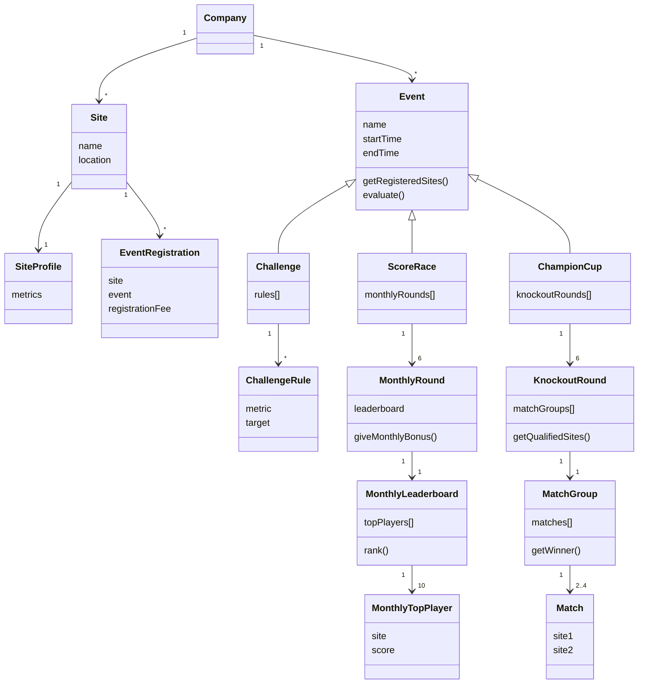
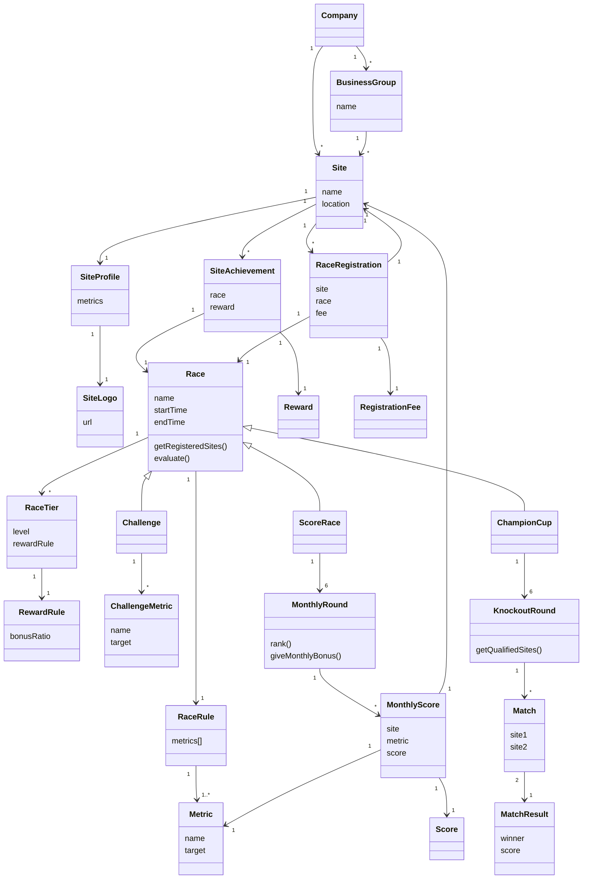
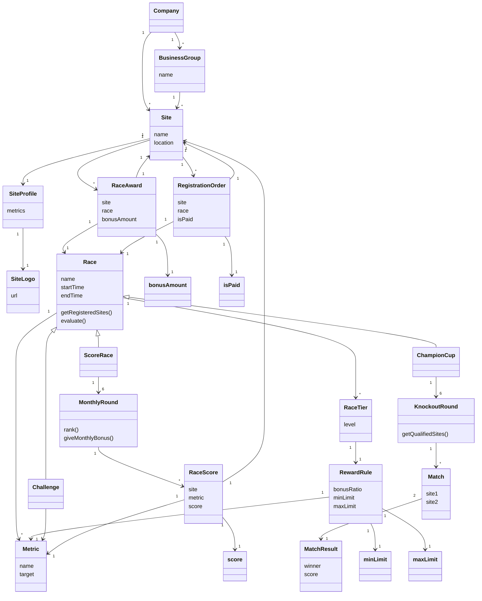
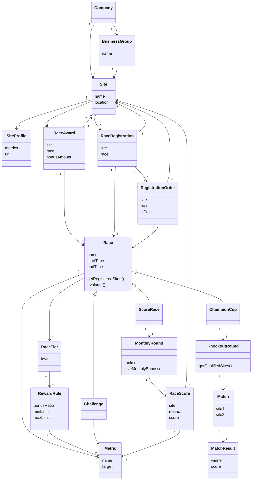

<!---
markmeta_author: titlwind
markmeta_date: 2023-07-06
markmeta_title: 我与AI助理的一天
markmeta_categories: ai
markmeta_tags: ai,prompt-engineering
-->

# 我与AI助理的一天


## 07:00 早餐 - 营养专家建议

> 最近体检，被查出体重超过BMI指数(身体质量指数)，得减肥了。 
> 早上要吃点啥呢？ 问问我的 AI 助理吧！

### 减肥菜单(询问AI)
```
你现在扮演一个营养专家的角色, 你的任务是生成一个一周减肥菜单列表。
从周一到周日，分别列出"早餐"、"午餐"、"晚餐"的菜单。
每餐的菜单数量2-4个。
菜单要注重营养均衡，且符合我个人的情况。
我是男生、35岁、身高165公分、体重68公斤。
按照表格的形式列出。
```

### 减肥菜单(AI回答)

以下是根据您的年龄、身高和体重制定的一周减肥菜单。请注意，我不是营养专家，但我会尽量提供一些建议。在实际操作时，请务必咨询专业营养师的意见。

星期| 早餐| 午餐| 晚餐    
---|---|---|---  
周一| 燕麦粥、鸡蛋白、西兰花、苹果| 鸡胸肉沙拉、全麦面包| 烤三文鱼、蒸蔬菜、糙米    
周二| 全麦吐司、煮鸡蛋、香蕉| 牛肉炒蔬菜、糙米| 意大利炖肉、烤南瓜、绿叶蔬菜    
周三| 酸奶、坚果、水果(如橙子)| 鸡肉卷饼、生菜沙拉| 豆腐炒青菜、糙米    
周四| 全麦面包、花生酱、牛奶| 虾仁炒蔬菜、糙米| 烤鸡胸肉、蒸红薯、绿叶蔬菜    
周五| 鸡蛋白煎饼、新鲜水果(如蓝莓)| 鱼排沙拉、全麦面包| 意大利面配番茄酱、绿叶蔬菜    
周六| 酸奶、燕麦片、新鲜水果(如草莓)| 牛肉炒蔬菜、糙米| 烤三文鱼、蒸蔬菜、糙米    
周日| 全麦吐司、煮鸡蛋、香蕉| 鸡肉卷饼、生菜沙拉| 豆腐炒青菜、糙米    
    
为了达到减肥的目的，您还需要注意以下几点：

  * 每天保证充足的水分摄入。
  * 避免过多的油炸食品和高糖食品。
  * 增加有氧运动，如慢跑、游泳或骑自行车等。
  * 确保每天获得足够的睡眠。


### 减肥菜单(AI回答)

好的,我来为您制定一周的减肥菜单:

| | 早餐 | 午餐 | 晚餐 |
|-|:-:|:-:|:-:|
|周一|全麦面包1片+低脂酸奶1杯+苹果1个|白灼蛋2个+米饭1碗+菠菜1小碗|瘦肉粥1碗+青菜沙拉1小碗|
|周二|燕麦片1碗+低脂牛奶1杯|鸡蛋拌饭1碗+素炒西兰花1小碗|蒸鱼1个+炒绿菜1小碗+红枣糙米粥1小碗|
|周三|全麦吐司2片+低脂奶酪1片|肉末沙拉1小碗+米饭1碗|鲜蔬汤1碗+白灼鸡胸肉2片+素炒菜心1小碗|
|周四|燕麦粥1碗+苹果1个|青菜豆腐汤1碗+米饭1碗|蒸排骨1块+炒菠菜1小碗+红枣腰果粥1小碗|
|周五|香蕉1根+低脂酸奶1杯|肉片粥1碗+菜心拌豆腐1小碗|清蒸鱼1条+青菜沙拉1小碗+红枣山药粥1小碗|
|周六|全麦吐司1片+鸡蛋1个+低脂奶酪1片|白切鸡肉汤1碗+米饭1碗|蒸菜心1小碗+炖猪肉1块+红枣蛋白粥1小碗|
|周日|燕麦片1碗+苹果1个|肉末白菜汤1碗+米饭1碗|清炒金针菇1小碗+鱼片1小碗+红枣山药粥1小碗|


### 菜单热量和营养(询问AI)

请计算以下早餐食物每一项的热量，并说明其包含哪些营养，以及对身体有哪些好处: 
1. 全麦面包1片
2. 低脂酸奶1杯
3. 苹果1个


### 菜单热量和营养(AI回答)

好的,我来帮您计算这些早餐食物的热量和营养成分:

1. 全麦面包1片
- 热量:约75千卡
- 含钙、磷、铁等矿物质。麦麸含有膳食纤维,有助于肠胃蠕动。
2. 低脂酸奶1杯
- 热量:约100千卡
- 含蛋白质、钙、维生素B2等。有益肠道菌群,增强免疫力。
3. 苹果1个
- 热量:约100千卡
- 含膳食纤维、维生素C、硼等。苹果中的膳食纤维可帮助控制胆固醇,维生素C具抗氧化作用。

总热量约275千卡。这些食物Nutritious且低脂肪,非常适合早餐,可以提供充足能量,还可满足一些重要营养需求。


## 08:00 新闻阅读 - 国际关系分析

> 最近看到一个新闻： “中国最近对镓、锗进行出口管制”。
> 面对美国的芯片制裁，中国开始反制了。
> 这到底好还是不好？  问问我的 AI 助理吧！


### 国际关系分析(询问AI)
```
你现在是一个国际关系专家，你的任务是阐述对中国最近对镓、锗进行出口管制的看法。
首先，说明这次出口管制对中美关系的可能产生影响。
其次，分别说明这次管制可能会给中国带来好处和坏处。
```


### 国际关系分析(AI回答)

好的,我会尽力以一个国际关系专家的角度来回答您的问题:

对中美关系的影响:

中国最近对镓、锗等稀土金属实施出口管制,在一定程度上会加剧中美之间的经济和技术竞争。美国对这些稀土金属有很大的依赖,用于高科技产品的制造。出口管制可能会影响美国科技企业的生产。这可能会进一步加剧中美贸易和技术争端。但是如果中国过度使用经济杠杆,也可能适得其反,推动美国加速发展自身的稀土金属产业,减少对中国的依赖。

对中国的好处:

- 有助于中国发展稀土金属下游产业,提升在全球价值链中的地位。
- 可以增加中国在稀土金属贸易中的议价能力和主导权。
- 可以更好地保护本国资源,避免资源的大量无序开采和浪费。

对中国的坏处:

- 可能导致其他国家也采取报复性措施,损害中国的经济利益。
- 国际社会可能批评中国使用经济杠杆作为政治工具。
- 可能加剧中国的资源民族主义,导致对外贸易保护主义盛行。
- 可能阻碍中国企业走向国际,打破全球价值链。
- 可能加剧全球通胀压力。

总体来说,中国需要在发展自己的重要产业和维护全球贸易体系之间找到平衡。既要合理利用规制性措施,也要避免贸易保护主义。中美之间需要加强沟通协调,妥善处理彼此的战略关切。


## 09:00 会议信息同步

> 周末开会，对86国际家政员工节进行的同步。
> 想要给团队同步一下主要内容，会议内容在一个 PDF文件, 让 AI 帮我提炼一下核心内容吧！


### 内容总结(询问AI)
```
上传 “86同步.pdf”, 进行核心内容总结
```


### 内容总结(AI回答)

根据附件的演讲内容,我总结出以下几点核心信息:

- 回顾过去一年家政行业面临的困难和挑战,但仍充满信心和决心继续前行。
- 强调家政职业的社会认可度和职业价值,呼吁社会各界重视家政职业化发展。
- 介绍了2022年国际家政员工节的系列活动设计,包括服务设计大赛、城市家年华等。
- 突出“服务”和“家”这两个关键词,通过服务创新、家庭观念传播等方式提升家政形象。
- 号召家政从业者树立自信,通过专业服务赢得社会认同和尊重。
- 引导行业思考家政发展路径,实现职业价值和社会价值的统一。
- 传递积极乐观和崛起的精神,激励大家团结奋斗,以创新思维引领家政行业进步。

关键词:信心、团结、创新、服务、家庭、自信、社会认同。


> 是否可以进一步转换为一个会议发言稿呢？


### 会议内容生成(询问AI)
```
你是部门主管，生成简短的包含以上信息的会议内容，
目标对象是部门团队成员，
内容最后需要鼓励大家积极报名参加活动安全员的工作，为家政员工创造更好的节日体验。
```

### 会议内容生成(AI回答)

各位团队成员:

国际家政员工节活动即将到来，活动以“服务”和“家”为核心,弘扬家政精神,提升社会认可度。我们要团结奋斗,发挥专业精神,确保活动安全顺利。

过去一年面临诸多困难,但我们选择信心和决心继续前行。相信通过创新和进步,家政行业必将迎来新的发展。

本次活动安排丰富,包括服务设计大赛、城市家年华等。这是展示家政风采、传播正能量的好机会。我们要树立自信,以专业服务赢得社会尊重。

让我们共同努力,为广大家政员工营造安全、快乐的节日氛围。

我们是这个行业的一份子,每个人都发挥重要作用。希望大家积极报名参与安全员工作,为家政同仁创造美好体验!

让我们继续向前,以崭新姿态迎接家政行业的新机遇!


## 09:30 营销大师


> 做营销的同学说想写一篇关于打折营销密码的公众号文章，吸引一波流量，但苦于没有时间整理。
> 没问题，我让 AI 助理给你生成一个基础文稿。


### 文章生成(询问AI)
```
你现在是商品营销，促销大师，请学习以下示例：

- 原价 7.5 折(买4送1): 充值3倍当天免费
- 原价 6.7 折(买2送1): 3人同行1人免单
- 原价 5 折(买1送1): 第2斤半价第3斤免费

对于8折和9折, 还可以如何表述。

请思考以上示例，写一篇营销密码文章。要求：

- 为了促进销量，提升商品价值感。
- 列举更多的营销案例，给出具体执行方案。
- 可以从资金快速回笼，扩大销售额，营销裂变等方面具体讨论。
- 文章结构不要使用首先，然后，最后之类的段落来衔接，语言连贯，过渡自然。
```


### 文章生成(AI回答)

标题：揭秘商品营销密码：促销策略的创新与突破

在商品营销的世界里，优秀的促销策略不仅能激发消费者的购买欲望，还能有效提升商品的价值感。以下我们将深入探讨几种具有代表性的促销案例，并揭示其背后的营销密码。

案例一：原价7.5折（买4送1）

这个策略的精髓在于“买4送1”，它巧妙地利用了消费者的心理，使得购买5件商品的实际价值感远超于原价购买5件商品。这样的促销策略可以在短时间内刺激消费者购买更多的商品，从而实现资金快速回笼。同时，对于消费者而言，打折加上赠品，无疑让每一件商品都变得更加实惠。

案例二：原价6.7折（买2送1）

在这个策略中，“买2送1”是一个非常有吸引力的元素。它不仅鼓励消费者购买更多的商品，还提高了消费者对品牌的忠诚度。此外，通过“3人同行1人免单”的方式，该策略还鼓励了社交分享和群体消费，从而扩大了销售额。

案例三：原价5折（买1送1）

在这个案例中，“买1送1”无疑是最具吸引力的元素。然而，其背后的营销策略更深一步，通过“第2斤半价第3斤免费”，该策略鼓励消费者购买更多，同时，也提供了一种“分享”的激励机制，从而通过口碑传播和社交媒体，进一步扩大了品牌的影响力和销售额。

深入解析：商品营销的策略创新

以上的三个案例，都展示了优秀的促销策略如何提升商品的价值感，同时实现资金快速回笼和销售额的扩大。其背后的营销密码，可以总结为以下几点：

创造超值感受：无论是买4送1、买2送1还是买1送1，这些策略的核心都是让消费者感受到购买商品的实际价值远超于原价值，从而刺激消费者购买更多的商品。
鼓励共享和口碑传播：通过激励消费者分享购物体验和折扣优惠，可以进一步扩大品牌的影响力和销售额。例如，案例二中的“3人同行1人免单”，以及案例三中的“分享”机制，都是鼓励消费者进行共享和口碑传播的实例。
社交互动与参与感：通过让消费者参与互动活动，如分享、点赞、评论等，可以增加品牌的活跃度和消费者的参与感，从而提高销售额和品牌忠诚度。
提供个性化体验：针对不同消费者的需求和偏好，提供个性化的促销策略和体验，可以增强消费者对品牌的认同感和忠诚度。
灵活的营销策略：根据市场环境和销售状况，灵活调整促销策略，例如根据不同的节日、季节或地区，提供相应的主题优惠活动，可以吸引更多的消费者。
总结：

商品营销的艺术在于如何巧妙地激发消费者的购买欲望和提升商品的价值感。通过创新和突破的促销策略，可以实现资金快速回笼和销售额的扩大。而这些营销密码的实现，都需要对消费者的需求和心理有深入的理解和把握，以及对市场环境和竞争状况的敏锐洞察。


### 文章生成(AI回答2)

营销密码：让你销量翻倍的促销策略
在商品营销中，促销是刺激消费者购买欲望的重要手段。一个好的促销策略不仅可以提高销售额，还可以提升商品的价值感，增加消费者的购买满意度。下面，我们将通过具体的案例来探讨一些营销密码，让你销量翻倍。

一、价格折扣促销

价格折扣促销是最常见的促销方式之一，通过降低商品的价格来吸引消费者。在价格折扣促销中，可以根据商品的原价和折扣力度来制定不同的策略。例如，原价 7.5 折（买 4 送 1）的促销策略，消费者在购买 4 件商品时可以享受到 7.5 折的优惠，获得一件免费的商品。这种策略可以增加消费者的购买量，提高销售额。

二、买赠促销

买赠促销是指在消费者购买一定数量或金额的商品时，可以获得一定数量或金额的赠品。这种促销策略可以增加消费者的购买欲望，提高商品的价值感。例如，原价 6.7 折（买 2 送 1）的促销策略，消费者在购买 2 件商品时可以享受到 6.7 折的优惠，获得一件免费的商品。这种策略可以吸引消费者主动购买，提高销售额。

三、组合销售促销

组合销售促销是指将多种相关的商品组合在一起，以更优惠的价格出售。这种促销策略可以增加消费者的购买量，提高销售额。例如，原价 5 折（买 1 送 1）的促销策略，消费者在购买 1 件商品时可以享受到 5 折的优惠，获得一件免费的商品。这种策略可以吸引消费者主动购买，提高销售额。

四、资金回笼促销

资金回笼促销是指通过一定的促销策略，使消费者尽快支付购买商品的款项，以便企业快速回笼资金。例如，一些商家会推出限时抢购活动，让消费者在规定的时间内支付款项，可以享受到更优惠的价格。这种策略可以提高销售额，加速资金回笼。

五、营销裂变促销

营销裂变促销是指通过一定的促销策略，让消费者主动将商品信息分享给其他人，从而扩大销售额。例如，一些商家会推出分享有礼活动，让消费者在分享商品信息后可以获得一定的优惠或赠品。这种策略可以提高商品的知名度，增加消费者的购买量。
以上就是一些常见的促销策略，让你在商品营销中脱颖而出，提高销售额。当然，不同的商品和市场环境需要相应的促销策略，具体执行时需要灵活运用。通过以上的营销密码，相信你可以找到适合自己的促销策略，让你的销量翻倍。


## 10:00 系统架构设计


> 团队要做经营竞赛系统，时间紧，任务重，让 AI 助理帮我设计一下！


### 系统架构设计(询问AI 1)

你现在是一个资深的系统架构师和产品经理，我会逐步提供给足够的产品信息给你，你的任务是根据我提供的信息生成系统模型设计。

你的架构设计要符合简单、可扩展的要求。

如果你识别到模型和模型之间有通用的概念，需要将其进行抽象为一个新的底层模型。

产品信息如下：
1. 以公司纬度组织比赛，参赛对象是各个站点；
2. 每个月公司可以使用经营指标设置多个“挑战赛”赛事，站点需要报名才能参加“挑战赛”；站点报名需交纳一定报名费；站点的经营指标达到赛事要求视为挑战成功，否则视为挑战失败；挑战成功将得到指定的奖金。
3. 公司每半年举办一次“积分赛”赛事，“积分赛”会设置多个经营指标评分标准，达到指标即可获得对应分数；每次积分赛包含6个月，每个月进行一次指标考核并给出分数；站点6个月的积分累积之和就是该站点积分赛的最终得分；每个月当月积分的前10名给予一定的奖金；
4. 公司每半年举办一次“冠军杯”赛事, 参赛的站点是上一个半年“积分赛”赛事最终积分的前32名；冠军杯分6个月, 每个月进行淘汰赛，32只队伍按照随机分组； 
  - 第1个月淘汰赛后剩下16强；
  - 第2个月淘汰赛后剩下8强；
  - 第3个月淘汰赛后剩下4强；
  - 第4个月淘汰赛后剩下2强；
  - 第5个月进行季军赛选出3、4名；
  - 第6个月军训决赛选出1、2名；
5. “冠军杯”赛事前3名给予指定奖金；


生成的模型设计按照 mermaid 格式进行输出。


### 系统架构设计(AI回答 1)

根据产品信息,我理解到以下几点需求:

1. 需要对公司内部的站点进行组织和管理
2. 需要支持不同类型的赛事:挑战赛、积分赛、冠军杯
3. 每种赛事都有自己的报名、评分、淘汰、获奖机制
4. 需要支持按月进行赛事和评分

为了支持以上需求,我设计了以下模型:



这个模型主要包含以下部分:

- Company、Site表示公司和站点
- Event、EventRegistration用于支持不同赛事的注册
- Challenge、ScoreRace、ChampionCup表示不同类型的赛事
- ChallengeRule、MonthlyRound、KnockoutRound表示赛事的评分和淘汰机制
- MonthlyLeaderboard、MatchGroup用于管理评分和淘汰结果

该模型通过继承和组合来抽象出共性概念,可以灵活地支持新增赛事类型。每种赛事类型都实现了evaluate()方法用于按需评分。

请您检查该模型设计是否符合产品需求,如果有需要调整的地方请指出,我会进行优化。


### 系统架构设计(询问AI 2)

请按照如下调整要求和补充产品信息重新生成系统模型设计。

调整要求:
1. 用 Race 来表示底层赛事抽象更合理, 故用 Race、RaceRegistration 来替代 Event、EventRegistration；
2. 不需要 MonthlyLeaderboard 模型, 只需要在 MonthlyRound 增加一个 rank 排名即可
3. 所有赛事规则都是基于一个或多个指标纬度，根据这些纬度指标完成情况分成多个档位，按照不同档位等级进行不同等级的奖励。所以可以抽象出共通的 “赛事规则” 模型和 “赛事档位”模型。
4. 一个站点某个赛事、某个月、某个指标完成情况以及所获得的分数，也可以抽象一个共通的“赛事得分”模型；


补充产品信息:
1. 每个站点有其站点队徽 logo；
2. 每个站点归属与某一个事业部；
3. 每个赛事指定了报名费；
4. 每个赛事档位指定了奖励规则，即多少倍的报名费的奖金；
5. 每个站点都可以查看自己的获奖记录及其奖金；


### 系统架构设计(AI回答 2)

感谢您的反馈,我根据您的调整要求和补充产品信息,重新设计了系统模型:



主要调整如下:

- 添加了BusinessGroup表示事业部
- 使用Race、RaceRegistration替代Event和EventRegistration
- 增加SiteAchievement记录站点的获奖信息
- 抽象出RaceRule、Metric、RaceTier等共性模型
- 去掉MonthlyLeaderboard,在MonthlyRound中增加排名逻辑

请检查是否符合要求,如有需要调整请指出,我会继续优化模型。


### 系统架构设计(询问AI 3)


请再按照如下调整要求和补充产品信息重新生成系统模型设计。

调整要求:
1. 将 SiteAchievement 改名为 RaceAward(赛事奖励), 通过site_id字段关联站点, 增加 bonus_amount(奖金金额)字段
2. 去掉 Reward 模型;
3. 去掉 RaceRule 模型;
4. RewardRule模型中增加指标字段 关联 Metric 模型；
5. RewardRule模型中增加最小、最大指标值2个字段框定奖励范围;
6. RaceTier 模型 和 RewardRule模型 是一对多关系；
7. 去掉 ChallengeMetric模型，使用共通的 Metric 模型；
8. MonthlyScore模型改名为 RaceScore 模型，作为通用模型，适用于记录挑战赛、积分赛、冠军杯的赛事得分；
9. 去掉 Score 模型，在 RaceScore 模型中增加 scroe分数字段即可；
10. 去掉 RegistrationFee模型，增加 RegistrationOrder(报名订单)模型，报名订单负责控制完成支付；

补充产品信息:
1. 奖励是当月发放，但要求获得奖励的站点需要保持一定时间的指标情况，否则会产生扣除奖金的情况。
2. 负向的奖金也是记录在RaceAward(赛事奖励)模型中，只是奖金值为负值。


### 系统架构设计(AI回答 3)
您提供了很好的优化建议,我根据您的要求做了调整:



主要调整:

- RaceAward替代SiteAchievement 
- 增加RegistrationOrder处理支付
- 调整奖励规则相关模型
- 统一使用Metric
- 调整评分记录为RaceScore

请确认是否符合要求,我会继续对模型进行优化。非常感谢您的反馈!


### 系统架构设计(询问AI 4)

请再按照如下调整要求重新生成系统模型设计。

调整要求:
1. 去掉 sitelogo 模型，将 url 字段放到 SiteProfile 模型中
2. 去掉 bonusAmount 模型，它只是一个字段；
3. 去掉 isPaid 模型，它只是一个字段；
4. 去掉 minLimit 模型，它只是一个字段；
5. 去掉 maxLimit 模型，它只是一个字段；
6. 去掉 score模型，它只是一个字段；
7. 保留 RaceRegistration(站点赛事注册)模型，它和 RegistrationOrder 是一对多关系;


### 系统架构设计(AI回答 4)

您提供的调整建议非常合理,我已经根据您的要求对模型进行调整:



请确认我的调整是否符合要求。非常感谢您的指导,这对我改进系统模型设计非常有帮助。如果还有可以优化的地方,请您指出,我会继续改进。


## 草稿 TODO


09:30 作为保洁师提供保洁服务：AI，如何确定最佳的保洁频率和清洁重点？
10:30 作为站长协调一线服务人员：AI，如何提高站点服务质量和效率？
11:00 作为管家和客户沟通：AI，如何更好地满足客户需求，提高客户满意度？
11:30 作为市场营销主管策划营销方案：AI，如何确定目标客户群体和营销策略？

12:00 午餐：AI，这个食物的营养构成如何？我应该搭配什么食物来平衡饮食？
12:30 下午工作：AI，如何保持精力充沛并提高工作效率？
13:30 作为HR发展人才：AI，如何招聘和培养高素质的员工？
14:30 作为程序员开发程序：AI，如何调试代码和提高程序效率？
15:00 作为管理者做团队绩效分析：AI，如何激励员工和提高团队绩效？
16:00 作为财务计算财务报表：AI，如何进行税务优化和风险管理？
17:00 健身：AI，我的运动效果如何？我应该如何制定个性化的健身计划？
18:00 晚餐：AI，这个食物的烹饪时间和温度是多少？我需要准备哪些调料和配菜？
19:00 家庭聚餐：AI，如何更好地与家人沟通，提高家庭关系？
20:00 学习：AI，这个知识点和哪些其他知识点有关联？我应该如何制定有效的学习计划？
20:00 购物（24:00）：AI，这个商品是否有优惠活动？我需要根据什么因素来选择购买它？
20:30 休闲娱乐：AI，如何更好地享受电影或者音乐等娱乐活动？
21:00 睡前：AI，我的睡眠质量如何？我应该如何改善睡眠环境并保持良好的作息习惯？

现在有一个评价数据表格, 文件名称是 evaluation.csv，其中包含7列，分别是  "被评人"、"评价人"、"专业技术"、"业务理解"、"学习分享"、"沟通协作"、"影响力"，
其中"专业技术"、"业务理解"、"学习分享"、"沟通协作"、"影响力"这5列为指标列，值的格式是数值。
指标"总体评价"不在数据表格中，而是通过计算得出，计算方式为"专业技术"、"业务理解"、"学习分享"、"沟通协作"、"影响力"这5个指标的平均分。
数据表中每个"被评人"会有多笔被评记录, 每个"评价人"也有多笔评价记录。
你的任务是生成golang分析代码，请遵循以下要求:
1. 代码变量命名需要使用英文，注释用中文。
2. 按照被评人纬度计算所有指标的平均分, 按照 csv 格式输出到 evaluation_avg.csv 文件中
3. 表头包括"被评人"、"专业技术平均分"、"业务理解平均分"、"学习分享平均分"、"沟通协作平均分"、"影响力平均分"、"总体评价平均分"。
4. 每个指标的平均分是被评人所有被评记录的对应指标的平均分。


## A. Reference

