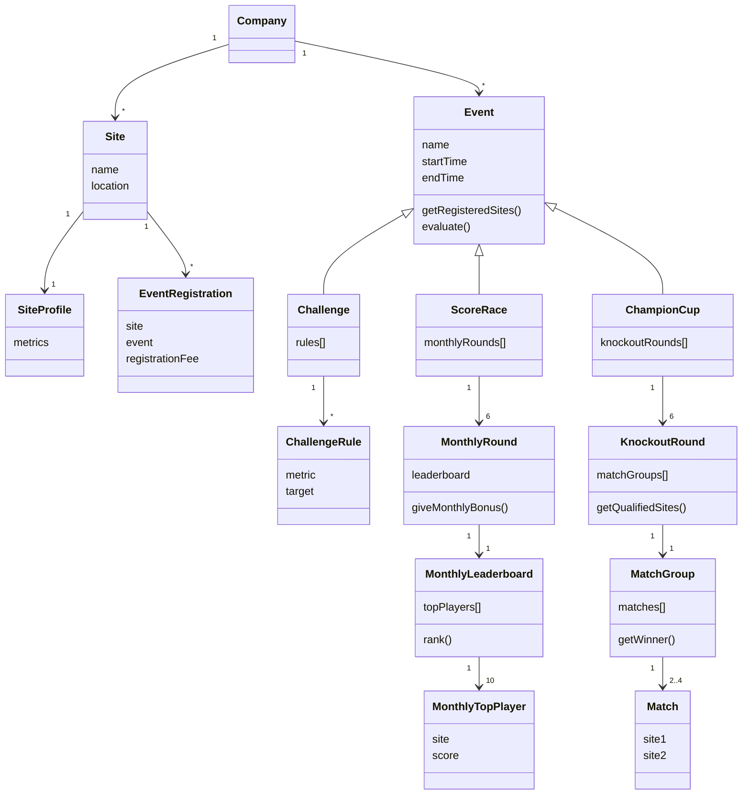
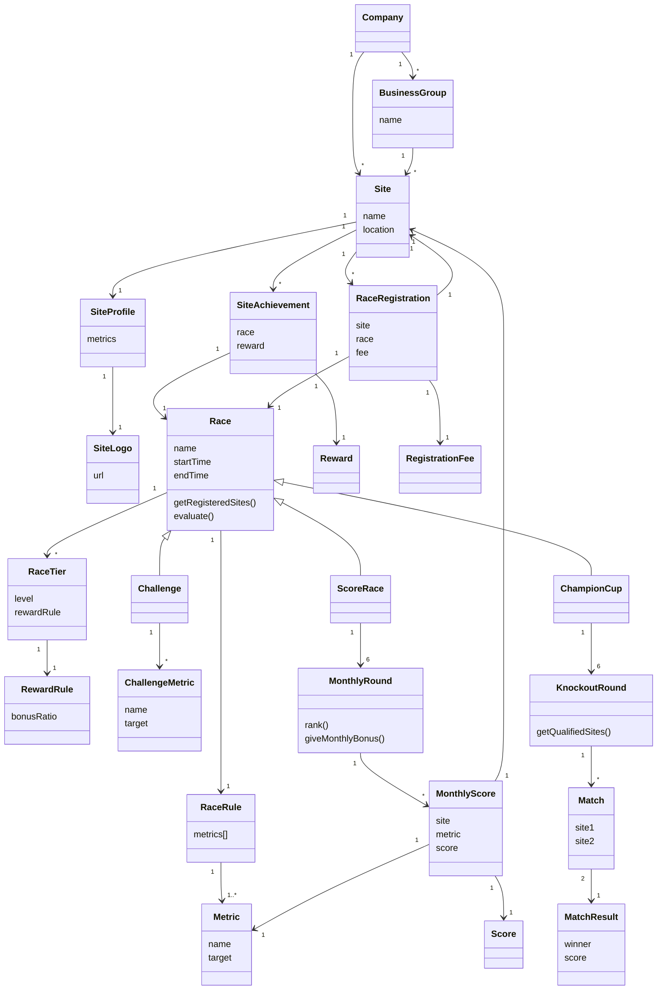
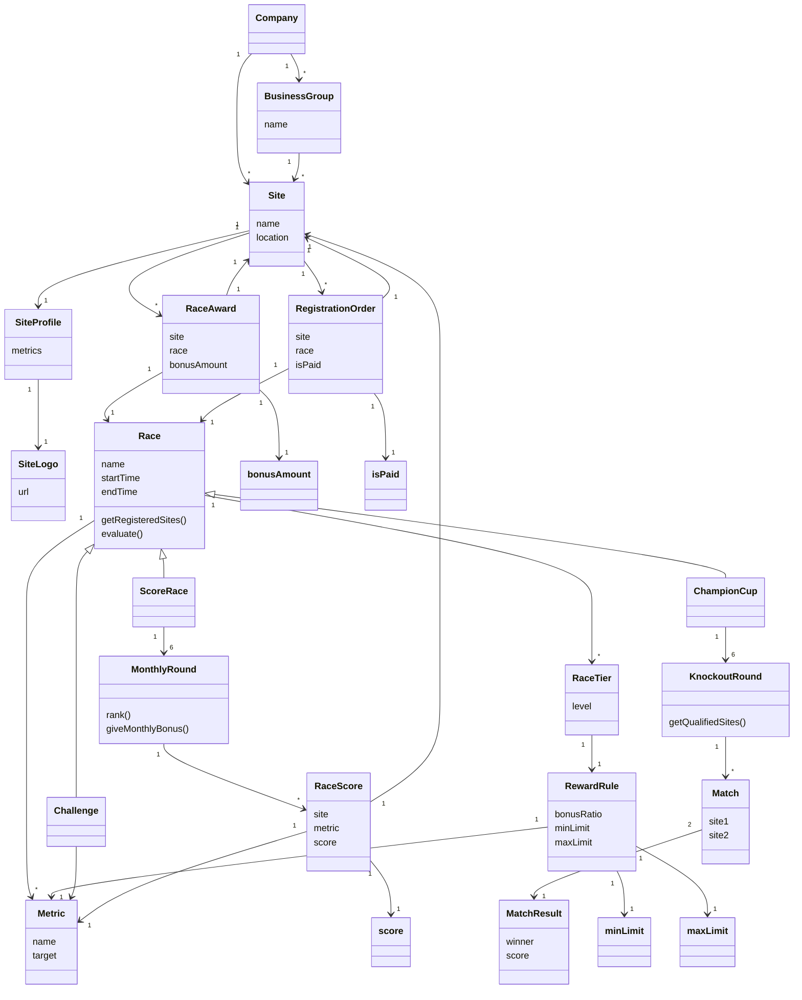
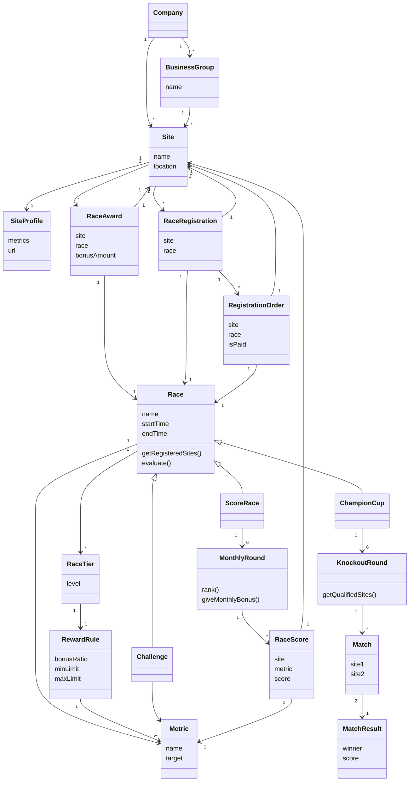

<!---
markmeta_author: titlwind
markmeta_date: 2023-07-06
markmeta_title: AI提示词 —— 系统设计之经营竞赛系统
markmeta_categories: ai
markmeta_tags: ai,prompt-engineering
-->
# AI提示词 —— 系统设计之经营竞赛系统

> 团队要做经营竞赛系统，时间紧，任务重，让 AI 助理帮我设计一下！

## 系统架构设计(询问AI 1)

你现在是一个资深的系统架构师和产品经理，我会逐步提供给足够的产品信息给你，你的任务是根据我提供的信息生成系统模型设计。

你的架构设计要符合简单、可扩展的要求。

如果你识别到模型和模型之间有通用的概念，需要将其进行抽象为一个新的底层模型。

产品信息如下：
1. 以公司纬度组织比赛，参赛对象是各个站点；
2. 每个月公司可以使用经营指标设置多个“挑战赛”赛事，站点需要报名才能参加“挑战赛”；站点报名需交纳一定报名费；站点的经营指标达到赛事要求视为挑战成功，否则视为挑战失败；挑战成功将得到指定的奖金。
3. 公司每半年举办一次“积分赛”赛事，“积分赛”会设置多个经营指标评分标准，达到指标即可获得对应分数；每次积分赛包含6个月，每个月进行一次指标考核并给出分数；站点6个月的积分累积之和就是该站点积分赛的最终得分；每个月当月积分的前10名给予一定的奖金；
4. 公司每半年举办一次“冠军杯”赛事, 参赛的站点是上一个半年“积分赛”赛事最终积分的前32名；冠军杯分6个月, 每个月进行淘汰赛，32只队伍按照随机分组； 
  - 第1个月淘汰赛后剩下16强；
  - 第2个月淘汰赛后剩下8强；
  - 第3个月淘汰赛后剩下4强；
  - 第4个月淘汰赛后剩下2强；
  - 第5个月进行季军赛选出3、4名；
  - 第6个月进行决赛选出1、2名；
5. “冠军杯”赛事前3名给予指定奖金；

生成的模型设计按照 mermaid 格式进行输出。

## 系统架构设计(AI回答 1)

根据产品信息,我理解到以下几点需求:

1. 需要对公司内部的站点进行组织和管理
2. 需要支持不同类型的赛事:挑战赛、积分赛、冠军杯
3. 每种赛事都有自己的报名、评分、淘汰、获奖机制
4. 需要支持按月进行赛事和评分

为了支持以上需求,我设计了以下模型:

这个模型主要包含以下部分:

- Company、Site表示公司和站点
- Event、EventRegistration用于支持不同赛事的注册
- Challenge、ScoreRace、ChampionCup表示不同类型的赛事
- ChallengeRule、MonthlyRound、KnockoutRound表示赛事的评分和淘汰机制
- MonthlyLeaderboard、MatchGroup用于管理评分和淘汰结果

该模型通过继承和组合来抽象出共性概念,可以灵活地支持新增赛事类型。每种赛事类型都实现了evaluate()方法用于按需评分。

请您检查该模型设计是否符合产品需求,如果有需要调整的地方请指出,我会进行优化。

## 系统架构设计(询问AI 2)

请按照如下调整要求和补充产品信息重新生成系统模型设计。

调整要求:
1. 用 Race 来表示底层赛事抽象更合理, 故用 Race、RaceRegistration 来替代 Event、EventRegistration；
2. 不需要 MonthlyLeaderboard 模型, 只需要在 MonthlyRound 增加一个 rank 排名即可
3. 所有赛事规则都是基于一个或多个指标纬度，根据这些纬度指标完成情况分成多个档位，按照不同档位等级进行不同等级的奖励。所以可以抽象出共通的 “赛事规则” 模型和 “赛事档位”模型。
4. 一个站点某个赛事、某个月、某个指标完成情况以及所获得的分数，也可以抽象一个共通的“赛事得分”模型；

补充产品信息:
1. 每个站点有其站点队徽 logo；
2. 每个站点归属与某一个事业部；
3. 每个赛事指定了报名费；
4. 每个赛事档位指定了奖励规则，即多少倍的报名费的奖金；
5. 每个站点都可以查看自己的获奖记录及其奖金；

## 系统架构设计(AI回答 2)

感谢您的反馈,我根据您的调整要求和补充产品信息,重新设计了系统模型:

主要调整如下:

- 添加了BusinessGroup表示事业部
- 使用Race、RaceRegistration替代Event和EventRegistration
- 增加SiteAchievement记录站点的获奖信息
- 抽象出RaceRule、Metric、RaceTier等共性模型
- 去掉MonthlyLeaderboard,在MonthlyRound中增加排名逻辑

请检查是否符合要求,如有需要调整请指出,我会继续优化模型。

## 系统架构设计(询问AI 3)

请再按照如下调整要求和补充产品信息重新生成系统模型设计。

调整要求:
1. 将 SiteAchievement 改名为 RaceAward(赛事奖励), 通过site_id字段关联站点, 增加 bonus_amount(奖金金额)字段
2. 去掉 Reward 模型;
3. 去掉 RaceRule 模型;
4. RewardRule模型中增加指标字段 关联 Metric 模型；
5. RewardRule模型中增加最小、最大指标值2个字段框定奖励范围;
6. RaceTier 模型 和 RewardRule模型 是一对多关系；
7. 去掉 ChallengeMetric模型，使用共通的 Metric 模型；
8. MonthlyScore模型改名为 RaceScore 模型，作为通用模型，适用于记录挑战赛、积分赛、冠军杯的赛事得分；
9. 去掉 Score 模型，在 RaceScore 模型中增加 scroe分数字段即可；
10. 去掉 RegistrationFee模型，增加 RegistrationOrder(报名订单)模型，报名订单负责控制完成支付；

补充产品信息:
1. 奖励是当月发放，但要求获得奖励的站点需要保持一定时间的指标情况，否则会产生扣除奖金的情况。
2. 负向的奖金也是记录在RaceAward(赛事奖励)模型中，只是奖金值为负值。

## 系统架构设计(AI回答 3)
您提供了很好的优化建议,我根据您的要求做了调整:

主要调整:

- RaceAward替代SiteAchievement 
- 增加RegistrationOrder处理支付
- 调整奖励规则相关模型
- 统一使用Metric
- 调整评分记录为RaceScore

请确认是否符合要求,我会继续对模型进行优化。非常感谢您的反馈!

## 系统架构设计(询问AI 4)

请再按照如下调整要求重新生成系统模型设计。

调整要求:
1. 去掉 sitelogo 模型，将 url 字段放到 SiteProfile 模型中
2. 去掉 bonusAmount 模型，它只是一个字段；
3. 去掉 isPaid 模型，它只是一个字段；
4. 去掉 minLimit 模型，它只是一个字段；
5. 去掉 maxLimit 模型，它只是一个字段；
6. 去掉 score模型，它只是一个字段；
7. 保留 RaceRegistration(站点赛事注册)模型，它和 RegistrationOrder 是一对多关系;

## 系统架构设计(AI回答 4)

您提供的调整建议非常合理,我已经根据您的要求对模型进行调整:

请确认我的调整是否符合要求。非常感谢您的指导,这对我改进系统模型设计非常有帮助。如果还有可以优化的地方,请您指出,我会继续改进。

