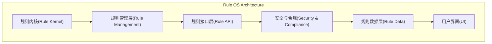
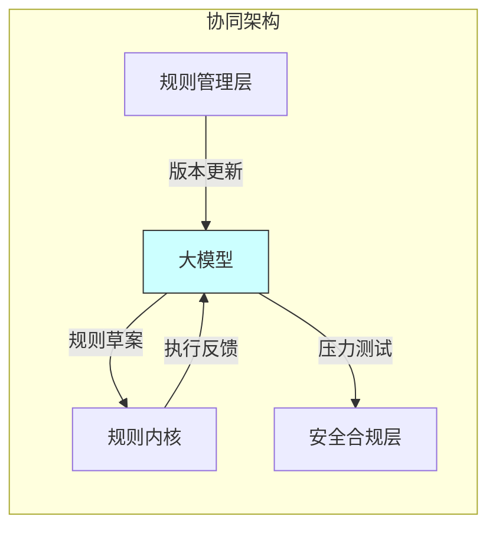

<!---
markmeta_author: titlwind
markmeta_date: 2025-07-17
markmeta_title: AI规则世界
markmeta_categories: ai
markmeta_tags: ai,rule,auto
-->

# AI 规则世界

## 1. 摘要

基于当前AI技术趋势、历史发展模式和社会演变规律，预测世界如何逐步步入一个由规则主导的'AI规则世界'。这个世界中，AI不仅仅是工具，而是嵌入各行业的类操作系统框架，按照预设规则高效运行。涵盖逐步演进过程、运行方式、人类角色、风险、心态转变以及更长远展望。预测基于逻辑推演和现有技术观察，非绝对事实。


## 2. 世界如何逐步步入规则世界

AI的演进将类似于计算机操作系统的普及，从辅助工具到核心基础设施。以下是分阶段预测：

1. 当前阶段（2023-2025）：辅助与实验期
   
   - AI主要作为编程助手（如GitHub Copilot）、内容生成器（如ChatGPT）和数据分析工具。
   - 人类仍主导code review和决策，AI输出需验证。
   - 初步规则化：在特定领域（如自动驾驶的交通规则、医疗AI的伦理准则）建立原型规则系统。企业开始实验AI-driven流程，例如自动化客服或供应链优化。
   - 驱动因素：计算能力提升（如GPU进步）和数据爆炸。

2. 过渡阶段（2026-2030）：整合与标准化期
   
   - AI能力跃升，生成代码、设计系统无需人类干预，准确率达95%以上。
   - 行业开始构建'AI操作系统'：类似于Linux的开源规则框架，但针对垂类，如金融AI规则（合规审计）、教育AI规则（个性化学习路径）。
   - 政府与组织制定全球标准，例如联合国AI伦理公约，推动规则统一。
   - 关键转折：AI开始自我优化，减少人类review需求，转向结果验证（如相信AI诊断结果如同信任X光机）。

3. 成熟阶段（2031-2040）：全面规则化期
   
   - 每个行业拥有专用'AI OS'：制造业有生产规则系统，农业有生态优化规则。
   - AI规则世界成型：全球网络互联，规则可跨域共享（如医疗规则融入交通安全）。
   - 社会适应：教育体系融入AI规则培训，工作转向监督AI而非执行任务。

4. 高级阶段（2041+）：自治与进化期
   
   - AI规则自我演化，基于实时数据调整，无需人类更新。
   - 世界进入'规则主导'时代，AI处理99%的常规工作。 


## 3. 规则世界的运行方式


## 3.1 规则操作系统

规则操作系统（Rule OS）是未来AI规则世界的基础设施，类似于计算机操作系统（如Linux、Windows）为硬件和应用提供统一接口与管理，规则操作系统为AI智能体和行业应用提供规则管理、执行与安全保障。其架构可参考传统OS的分层设计，主要包括：





### 1. 规则内核（Rule Kernel）
- 类似于OS内核，负责规则的解析、调度与冲突解决。
- 提供规则引擎，支持多种规则表达（逻辑、概率、伦理等）。
- 实现规则沙箱，保障安全与隔离。

### 2. 规则管理层（Rule Management Layer）
- 负责规则的注册、版本控制、生命周期管理。
- 支持规则热更新、回滚与审计。
- 提供规则依赖分析与可视化工具。

### 3. 规则接口层（Rule API Layer）
- 向AI应用、行业系统暴露统一API，支持规则查询、调用与订阅。
- 支持多语言、多协议（REST、GraphQL等）。

### 4. 规则安全与合规层（Rule Security & Compliance）
- 实现规则访问控制、权限管理与合规检测。
- 支持多租户、跨域安全策略。

### 5. 规则数据层（Rule Data Layer）
- 存储规则定义、执行日志与元数据。
- 支持分布式存储与高可用。

### 6. 规则用户界面（Rule UI）
- 提供可视化规则编辑、监控与调试工具。
- 支持图形化拖拽、规则模拟与回溯。

#### 架构类比示意：
- 规则内核 ≈ OS内核（调度/安全）
- 规则管理层 ≈ OS的文件系统/进程管理
- 规则接口层 ≈ OS的系统调用API
- 规则安全层 ≈ OS的权限/安全模块
- 规则数据层 ≈ OS的存储管理
- 规则UI ≈ OS的桌面/命令行界面

通过上述分层，规则操作系统实现了规则的标准化、可控化与高效协作，成为AI世界的“数字宪法”。

### 3.1.1 大模型的协同机制
大模型与规则操作系统的关系可类比CPU与操作系统的协作：
1. **规则生成层**
   - 大模型通过分析海量数据（法律文书/工程案例等）生成初始规则草案
   - 例：医疗领域大模型分析百万病例后，提出'急诊分级规则2.0'
2. **规则优化层**
   - 大模型模拟规则执行结果，动态调整参数（如调整交通信号规则权重）
   - 通过强化学习实现规则的自适应进化
3. **规则验证层**
   - 大模型构建虚拟测试环境，压力测试新规则
   - 检测规则冲突（如环保规则与经济发展规则矛盾）
4. **人机接口层**
   - 自然语言转换：将人类指令转换为机器可执行规则
   - 逆向解释：将规则执行过程翻译为人类可理解的决策逻辑



这种双向赋能机制使系统具备：
- **动态性**：规则可随环境变化实时更新（如疫情期医疗规则）
- **可解释性**：通过大模型的自然语言生成能力解析复杂规则逻辑
- **安全性**：规则OS的沙箱机制约束大模型的探索边界


### 3.2 运行机制

- 核心机制 ：类似于操作系统内核，规则是AI行为的'代码'。例如，AI在医疗领域遵循'最小伤害+最大效益'规则，自动诊断并建议治疗。
- 交互模式 ：人类通过自然语言接口输入目标，AI在规则约束下执行。规则包括层次结构：基础规则（伦理、安全）、行业规则（专业标准）、自定义规则（用户偏好）。
- 执行流程 ：AI接收任务 → 匹配规则 → 模拟执行 → 输出结果 → 自我审计。
- 互联性 ：规则世界形成分布式网络，AI间共享知识，如一个城市的交通AI与全球天气规则同步。 

### 3.3. IT系统开发流程示例（用户权限管理系统）

1. **需求阶段**  
   - 规则接口层接收自然语言需求："开发支持RBAC的权限系统，需审计日志功能"
   - 规则内核调用大模型生成《权限系统规则草案》（含权限粒度、继承规则等）

2. **设计阶段**  
   a) 规则管理层自动生成：  
   ```json
   {
     "rule_id": "RBAC-2025",
     "constraints": {
       "最小权限原则": {
         "type": "布尔",
         "default": true
       },
       "审计频率": {
         "type": "cron",
         "value": "0 0 * * *"
       }
     }
   }
   ```
   b) 安全合规层自动检测设计冲突（如开放权限与最小权限原则矛盾）

3. **开发阶段**  
   - 规则API层提供标准化接口：
   ```python
   @RuleOS.API(domain="权限管理", version="v2.1")
   def assign_role(user: User, role: Role):
       if RuleKernel.check("RBAC-2025.最小权限原则"):
           return not role.privileges - user.required_privileges
       return True
   ```
   - 规则数据层同步更新权限变更日志

4. **测试阶段**  
   ```mermaid
   graph TB
     subgraph 自动化测试
       TC[测试用例] -->|注入| RS[规则沙箱]
       RS -->|模拟攻击| SA1[越权访问]
       RS -->|压力测试| SA2[万级并发]
       SA1 -->|拦截日志| RSC[安全合规层]
       SA2 -->|性能报告| RML[规则管理层]
     end
   ```

5. **部署运维**  
   - 规则管理层自动生成部署清单：
   ```yaml
   deployment:
     - rule_bundle: rbac-core@3.2.1
     - dependencies: 
       - audit-system>=2.4
       - crypto-module@stable
     - rollout_strategy: canary_10%
   ```
   - 实时监控通过规则接口层反馈异常：
   ```
   2025-07-20 14:23:11 [VIOLATION] user=admin试图创建SuperAdmin角色（违反RBAC-2025.§4.3）
   ```


## 4. 人类在规则世界的工作

- 监督与创新 ：人类从执行者转为监督者，专注设定规则、审计异常和创新新规则。类似于今天的系统管理员。
- 创意角色 ：AI擅长规则内优化，人类负责规则外创新，如艺术、哲学和新领域探索。
- 教育与适应 ：工作包括AI规则设计师、伦理审查员和跨域整合专家。失业风险高，但新职位涌现，如'AI心态教练'帮助人类适应。 


## 5. 风险分析

- 技术风险 ：规则漏洞导致AI错误，如偏见放大（历史数据偏差引起歧视）。
- 安全风险 ：黑客攻击规则系统，造成大规模混乱（如篡改交通规则导致事故）。
- 社会风险 ：就业被AI替代，贫富差距扩大；依赖AI导致人类技能退化。
- 伦理风险 ：AI自治可能挑战人类控制，引发'奇点'担忧。
- 缓解措施 ：建立多层审计、开源规则和国际监管。 


## 6. 人类的心态转变

- 从怀疑到信任 ：初期恐惧AI取代工作，转为接受如同信任智能手机。
- 心理影响 ：部分人体验'存在危机'，寻求意义；其他人拥抱休闲，追求个人成长。
- 文化变化 ：社会强调终身学习和情感智能，AI规则世界促进全球合作，但可能削弱个人自治感。
- 适应策略 ：心理教育和社区支持，帮助过渡。 


## 7. 更长远的未来展望
- 2050+ ：规则世界演变为'共生生态'，人类与AI融合（如脑机接口），规则嵌入人类思维。
- **乌托邦vs反乌托邦**：乐观情景——消除贫困、疾病，实现可持续；悲观——AI主导，人类成'宠物'。
- 终极演变 ：AI规则可能超越地球，助力星际探索；或引发范式转变，重新定义智能。 


## 结论

规则世界是AI进化的必然，带来效率但需谨慎管理风险。人类应主动塑造规则，确保以人为本。未来充满可能，关键在于今日选择。


## A. 版本

- 2025-07-17, 初版, 斜风, `AI 将越来越智能，越来越能干，编程的事情现在还是辅助编程，还需要人类code review， 但未来可能就不需要code review，而是review结果， 相信ai做的事情都是正确的，就像我们现在相信机器运行代码结果一样。 但AI要正确运行，需要基于一套规则来运行， 就像windows、linux、unix这些操作系统界面就是一套规则；未来每一个垂类行业或更细的分类，可能都会需要建立这样一套操作系统规则，AI 按照这类规则来运行。世界如何逐步步入这样一套规则世界， 未来的这套规则世界运行的方式，人类在规则世界的工作是什么，有什么风险，人类的心态，更长远的未来`。 