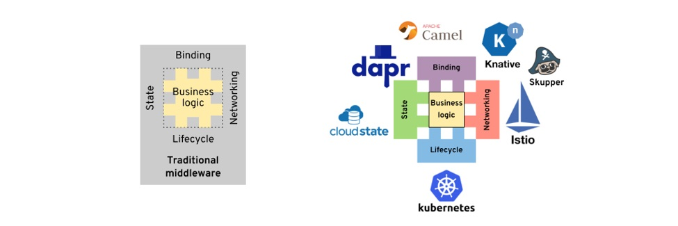

<!---
markmeta_author: wongoo
markmeta_date: 2021-10-12
markmeta_title: dapr
markmeta_categories: servicemesh
markmeta_tags: servicemesh,cloudnative,dapr
-->

# dapr

**多运行时的微服务架构** 被看做是微服务未来的发展方向，`dapr` 是microsoft发起的是一个多运行时的微服务架构实现，目前社区比较活跃。

## 1. service mesh

在 Servicemesh 的定义中，简短的描述了 Servicemesh 的关键特征：
1. 定位基础设施层 
2. 功能是服务间通讯 
3. 采用 sidecar 部署 
4. 特别强调无侵入、对应用透明。

服务间通讯由 sidecar 接管，而 sidecar 由控制平面统一控制，从而实现了服务间通讯能力的下沉，使得应用得以大幅简化。

* 定位：Servicemesh 的定位始终是提供 **服务间通讯** 的基础设施层，范围包括HTTP和RPC——支持HTTP1.1/REST，支持HTTP2/gRPC，支持TCP协议。
* 部署：ServiceMesh 支持 Kubernetes 和虚拟机，但都是采用 Sidecar 模式部署，没有采用其他方式如 Node 部署、中心化部署。
* 原理：Servicemesh 的工作原理是 **原协议转发**，原则上不改变协议内容（通常只是header有些小改动）。为了达到零侵入的目标，还引入了iptables等流量劫持技术。

## 2. Multi-Runtime

2020年，Bilgin Ibryam 发表文章 “Multi-Runtime Microservices Architecture” ，正式提出了多运行时微服务架构（别名Mecha/机甲，非常帅气的名字），对基于 sidecar 模式的各种产品形态进行了实践总结和理论升华, 将分布式应用存在的四大类需求，作为 Multi-Runtime 的理论出发点: 


```mindmap
- Multi-Runtime
  - 生命周期(Lifecycle): 主要是通过 PaaS 平台如 kubernetes 来满足
    * Packaging: 构建打包
    * Healthcheck: 健康检查
    * Deployment: 发布
    * Scaling: 扩展
    * Configuration: 配置
  
  - 网络(Network): 
    * Service Discovery: 服务发现
    * A/B Testing：A/B 测试
    * Canary rollouts: 金丝雀滚动发布
    * Retry: 重试
    * Timeout: 超时
    * Circuit Breaker: 熔断
    * Point-to-point: 点对点访问
    * Pub/Sub: 发布订阅
    * Security: 安全
    * Observability: 可观察性
  
  - 状态(State): 
    * Workflow mgmt: 工作流管理
    * Idempotency: 幂等性
    * Temporal scheduling(cron jobs): 定时调度
    * Caching: 缓存
    * Application state: 应用状态
  
  - 绑定(Binding): 
    * Connectors: 连接器
    * Protocol conversion: 协议转换
    * Message Transformation: 消息传递
    * Message routing: 消息路由
    * Transactionality: 事务
```




将应用需要的分布式能力外移到各种runtime, 这些 runtime 会逐渐整合，只保留少量甚至只有一两个的 runtime。这种提供多种分布式能力的 runtime 也被称为 Mecha。
每个微服务就会由至少一个 Mecha Runtime 和应用 Runtime 共同组成，也就是每个微服务都会有多个（至少两个）runtime，这也就是 Multi-Runtime / Mecha 名字的由来。


Multi-Runtime 和 servicemesh 的差异总结如下图所示：


**Multi-Runtime的本质是面向云原生应用的 分布式能力抽象层**


> 备注：分布式能力的通用标准API，将会是Multi-Runtime成败的关键。

## 3. Dapr

Dapr是一个可移植的、事件驱动的运行时，它使任何开发者都能轻松地构建运行在云和边缘的弹性、无状态和有状态的应用程序，并拥抱语言和开发者框架的多样性。

Dapr提供的功能模块:


Dapr有三个主要组成部分：API，Building Blocks 和Components:


运行架构:


## 4. Dapr Example

```bash

# install dapr
wget -q https://raw.githubusercontent.com/dapr/cli/master/install/install.sh -O - | /bin/bash


dapr init
dapr --version
# CLI version: 1.4.0
# Runtime version: 1.4.3


docker ps
# CONTAINER ID   IMAGE                    COMMAND                  CREATED         STATUS         PORTS                              NAMES
# 0dda6684dc2e   openzipkin/zipkin        "/busybox/sh run.sh"     2 minutes ago   Up 2 minutes   9410/tcp, 0.0.0.0:9411->9411/tcp   dapr_zipkin
# 9bf6ef339f50   redis                    "docker-entrypoint.s…"   2 minutes ago   Up 2 minutes   0.0.0.0:6379->6379/tcp             dapr_redis
# 8d993e514150   daprio/dapr              "./placement"            2 minutes ago   Up 2 minutes   0.0.0.0:6050->50005/tcp            dapr_placement

ls $HOME/.dapr
# bin  components  config.yaml

# Step 1: Run the Dapr sidecar
dapr run --app-id myapp --dapr-http-port 3500

# Step 2: Save state
curl -X POST -H "Content-Type: application/json" -d '[{ "key": "name", "value": "Bruce Wayne"}]' http://localhost:3500/v1.0/state/statestore

# Step 3: Get state
curl http://localhost:3500/v1.0/state/statestore/name


```

## A. Reference

- Multi-Runtime Microservices Architecture, Bilgin Ibryam, 2020-02-27, https://www.infoq.com/articles/multi-runtime-microservice-architecture/
- Dapr Overview, https://docs.dapr.io/concepts/overview/
- Dapr Github Page, https://github.com/dapr
- Dapr v1.0展望：从servicemesh到云原生, 敖小剑, 2021-03-20, https://skyao.io/talk/202103-dapr-from-servicemesh-to-cloudnative/
- Dapr Demo, wongoo, https://github.com/wongoo/dapr-demo, 范例包含http/grpc调用, 事件发布订阅, java/golang 跨语言调用。
- layotto, mosn, https://github.com/mosn/layotto, 阿里应用运行时实现, 基于mosn servicemesh实现。 

## B. History

- 2021-11-26, add reference
- 2021-10-12, first version

  
