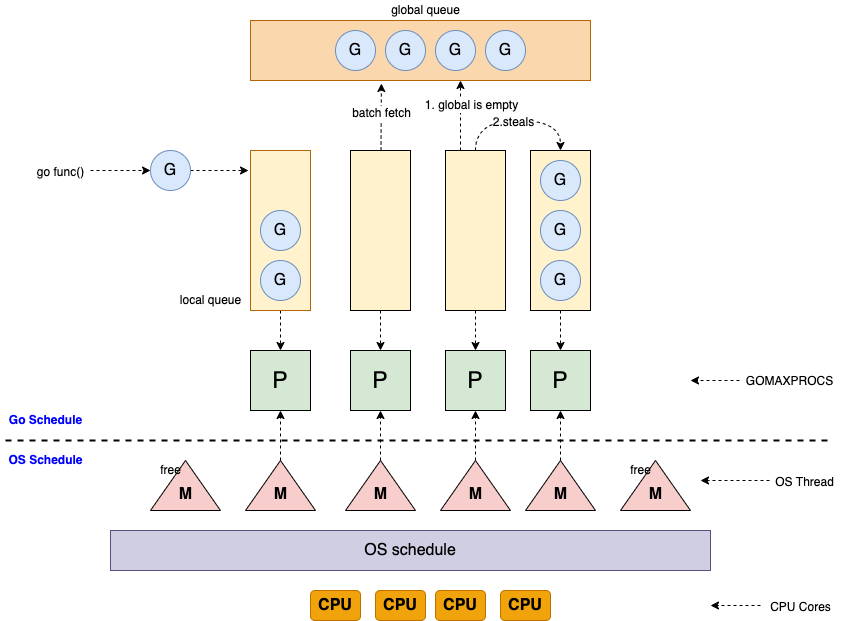
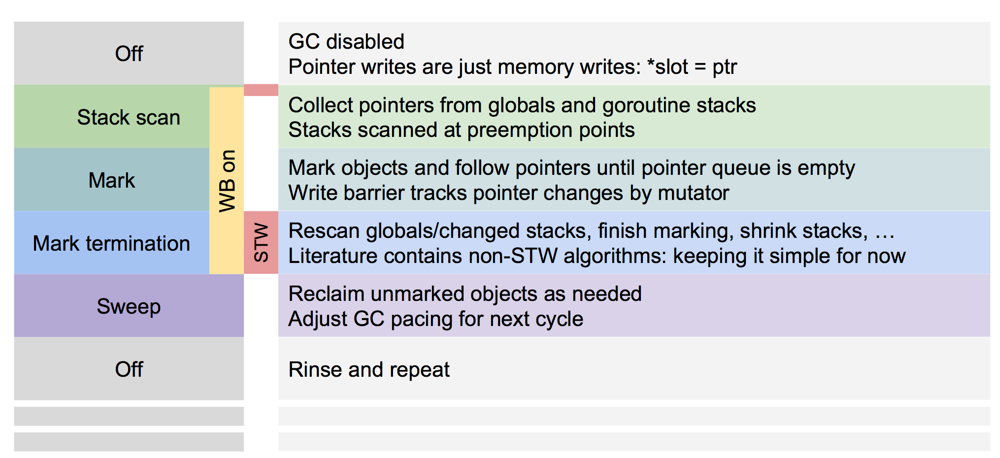

<!---
markmeta_author: wongoo
markmeta_date: 2020-02-07
markmeta_title: Golang 入门
markmeta_categories: 编程语言
markmeta_tags: golang
-->

# Golang 入门

**摘要**: 
本文简要介绍了Go语言的发展历史，通过文字和源代码形式介绍Go语言基本语法、开发工具、并发模型、垃圾回收机制。
本文作为Go语言的入门资料，读者可以通过本文快速了解Go语言的基本用法。


## 1. Golang 介绍

C++语言在Google内部是主要开发语言, C++执行效率高, 但C++存在一些缺点, 如学习难度大、开发低效。

其他语言如 .NET, Java, Python, 开发效率高, 执行效率低。

2007年，Google设计Go，目的在于提高在多核、网络机器（networked machines）、大型代码库（codebases）的情况下的开发效率。
当时在Google，设计师们想要解决其他语言使用中的缺点，但是仍保留他们的优点。
- 静态类型和运行时效率。（如 C ）
- 可读性和易用性。（如 Python 和 JavaScript）
- 高性能的网络和多进程。
- 垃圾回收。

Go于2009年11月正式宣布推出，版本1.0在2012年3月发布。
之后，Go广泛应用于Google的产品以及许多其他组织和开源项目, 包括 docker、kubernet、etcd、consul、flannel、tidb 等。
除了云项目外，还有像今日头条、UBER这样的公司，他们也使用GO语言对自己的业务进行了彻底的重构。

Go的三个作者分别是： Rob Pike（罗伯.派克），Ken Thompson（肯.汤普森）和 Robert Griesemer（罗伯特.格利茨默）。
* Rob Pike：曾是贝尔实验室（Bell Labs）的Unix团队，和Plan 9操作系统计划的成员。他与Thompson共事多年，并共创出广泛使用的UTF-8 字元编码。
* Ken Thompson：主要是B语言、C语言的作者、Unix之父。1983年图灵奖（Turing Award）和1998年美国国家技术奖（National Medal of Technology）得主。他与Dennis Ritchie是Unix的原创者。Thompson也发明了后来衍生出C语言的B程序语言。
* Robert Griesemer：在开发Go之前是 Google V8、Chubby 和 HotSpot JVM 的主要贡献者。

> 谷歌的“20%时间”工作方式，允许工程师拿出20%的时间来研究自己喜欢的项目。语音服务Google Now、谷歌新闻Google News、谷歌地图Google Map上的交通信息等，全都是20%时间的产物。Go语言最开始也是20%时间的产物。

Go 提倡少即是多(Less is more)，语言设计简单实用。
- 相比C++，Go并不包括如枚举、异常处理、继承、泛型、断言、虚函数等功能，但增加了 切片(Slice)、并发、管道、垃圾回收功能、接口等特性的语言级支持。Go 1.18 版本将支持泛型。
- 相比Java，Go原生提供了map支持，官方工具集包含代码格式化、性能调试工具、包管理功能。

Go支持协程(goroutine)，可以调度上百万的协程任务。

总结go的特点: 静态类型、静态编译、垃圾回收、并发支持、简单、安全、高效。

Go以囊地鼠（Gopher）作为它的吉祥物，go语言开发者也自称为gopher。


参考: 
1. [Go维基百科](https://zh.wikipedia.org/wiki/Go)
2. [三分钟了解Go语言的前世今生](https://juejin.cn/post/6844903808183566344)
3. [《The Way to Go》中文译本](https://github.com/unknwon/the-way-to-go_ZH_CN)


## 2. Go 安装

从 https://go.dev/dl/ 下载最新版本安装，也可以通过以下命令安装:

Mac环境安装:
```bash
curl -C - -O https://dl.google.com/go/go1.17.6.darwin-amd64.tar.gz
sudo tar -C /usr/local -xzf go1.17.6.darwin-amd64.tar.gz
```

Linux环境安装:
```bash
curl -C - -O https://dl.google.com/go/go1.17.6.linux-amd64.tar.gz
sudo tar -C /usr/local -xzf go1.17.6.linux-amd64.tar.gz
```

配置环境变量:
```bash
> sudo vi /etc/profile
export BASEDIR=/Users/myname
export GOPATH=$BASEDIR/go
export GOBIN=$GOPATH/bin
export PATH=$PATH:/usr/local/go/bin:$GOBIN
export GO111MODULE=on

# add direct to support private reporsitories, eg gitlab.
export GOPROXY=https://goproxy.cn,direct
# export GOPROXY=https://goproxy.io

export GOPRIVATE=gitlab.mycompany.com
```

升级: 
```bash
sudo rm -rf /usr/local/go
# then install the latest
```

检查安装情况:

```bash
go version
# go version go1.17.6 darwin/amd64
```


参考:
1. [golang versions](https://github.com/golang/go/tags)

## 3. Hello World 范例

Go 语言的基础组成有以下几个部分：

- 包声明
- 引入包
- 函数
- 变量
- 语句 & 表达式
- 注释

Hello World 范例:

```golang
// main.go
package main

import "fmt"

func main() {
    fmt.Println("Hello, World")
}
```

运行
```bash
# 格式化代码
go fmt .

# 运行代码
go run main.go
# Hello, World

# 编译二进制文件
go build -o main main.go

# 执行二进制文件
./main
# Hello, World
```

## 4. Golang Tools 工具

```
go help
Go is a tool for managing Go source code.

Usage:

	go <command> [arguments]

The commands are:

	bug         start a bug report
	build       compile packages and dependencies
	clean       remove object files and cached files
	doc         show documentation for package or symbol
	env         print Go environment information
	fix         update packages to use new APIs
	fmt         gofmt (reformat) package sources
	generate    generate Go files by processing source
	get         add dependencies to current module and install them
	install     compile and install packages and dependencies
	list        list packages or modules
	mod         module maintenance
	work        workspace maintenance
	run         compile and run Go program
	test        test packages
	tool        run specified go tool
	version     print Go version
	vet         report likely mistakes in packages
```

## 5. Go 关键字符

**25 个关键字**:
```
break	default	func	interface	select
case	defer	go		map		struct
chan	else	goto	package	switch
const	fallthrough	if	range	type
continue	for	import	return	var
```

**36 个预定义标识符**：
```
append	bool	byte	cap	close	complex	complex64	complex128	uint16
copy	false	float32	float64	imag	int	int8	int16	uint32
int32	int64	iota	len	make	new	nil	panic	uint64
print	println	real	recover	string	true	uint	uint8	uintptr
```

**标识符**: 一个或是多个字母(`A~Z` 和 `a~z`) 数字(`0~9`)、下划线`_`组成的序列，但是第一个字符必须是字母或下划线而不能是数字。

**分隔符**：括号 `()`，中括号 `[]` 和大括号 `{}`。

**标点符号**：`.`、`,`、`;`、`:`、`…`。


程序一般由关键字、常量、变量、运算符、类型和函数组成。


## 6. Go 类型

- bool类型: 只可以是常量 true 或者 false。一个简单的例子：var b bool = true。
- 数字类型: 
	* int: 基于架构的有符号整形, 一般来说，在32位系统中是4字节，在64位系统中是8字节, 可通过 `unsafe.Sizeof(n)` 获取一个变量的长度.
	* uint: 基于架构的无符号整形
	* uintptr: 基于架构的无符号指针类型, 无符号整形，可以存放一个指针
	* int8: 有符号 8 位整型 (-128 到 127)
	* int16: 有符号 16 位整型 (-32768 到 32767)
	* int32: 有符号 32 位整型 (-2147483648 到 2147483647)
	* int64: 有符号 64 位整型 (-9223372036854775808 到 9223372036854775807)
	* uint8: 无符号 8 位整型 (0 到 255)
	* uint16: 无符号 16 位整型 (0 到 65535)
	* uint32: 无符号 32 位整型 (0 到 4294967295)
	* uint64: 无符号 64 位整型 (0 到 18446744073709551615)
	* float32: IEEE-754 32位浮点型数
	* float64: IEEE-754 64位浮点型数
	* complex64: 32 位实数和虚数
	* complex128: 64 位实数和虚数
- 字符类型: 
	* byte: 字节, 类似 uint8
	* rune: 4byte的int32，对应unicode 码位字符
	* string: 字符串，字节使用 UTF-8 编码标识 Unicode 文本。 Java字符串则使用UTF-16字节数组，跨语言编码转换的时候需特别注意。
- 派生类型:
	* 指针类型(pointer)
	* 数组类型(array)
	* 切片类型(slice)
	* 结构化类型(struct)
	* Channel类型(chan)
	* 函数类型(func)
	* 接口类型(interface)
	* Map类型(map)


**参考**:
1. [IEEE二进制浮点数算术标准（IEEE 754）](https://zh.wikipedia.org/wiki/IEEE_754)


## 7. Golang 变量


### 7.1. 变量定义
```golang
func main() {
	// 指定类型定义
	var x string = "Hello World"
	fmt.Println(x)

	// 编译器自动判断类型
	name := "wongoo"
	fmt.Println(name)
}
```

### 7.2. 全局变量
```golang
var x string = "Hello World"
func main() {
    fmt.Println(x)
}
```

### 7.3. 静态变量
```golang
const x := "Hello World"
func main() {
    fmt.Println(x)

    const name string = "wongoo"
	fmt.Println(name)
}
```

### 7.4. 定义多个变量
```golang
// 每个变量单独定义并赋值
var ( 
	a = 5
	b = 10
	c = 15 
)

// 多个变量一起定义并赋值
var (
	a, b, c = 5, 10, 15
)

// 省略模式
a, b, c := 5, 10, 15
```

### 7.5. 枚举变量

go语言不支持枚举, 一般通过定义静态变量的方式来定义枚举：
```golang
const (
	ColorWhite = 0
	ColorRed   = 1
	ColorGreen = 2
)
```

当变量太多时可以通过 `iota` 简化定义:
```golang
const (
	ColorWhite = iota
	ColorRed
	ColorGreen
)
```

## 8. 控制语句

### 8.1. for 控制语句
```golang
func main() {
    i := 1
    for i <= 10 {
        fmt.Println(i)
		i = i + 1 
	}

	for j:=1; j <= 10; j++ {
        fmt.Println(j)
	}
}
```

### 8.2. if 控制语句
```golang
if i % 2 == 0 {
    // divisible by 2
} else if i % 3 == 0 {
    // divisible by 3
} else if i % 4 == 0 {
    // divisible by 4
}
```

### 8.3. switch 控制语句
```golang
switch i {
	case 0: fmt.Println("Zero")
	case 1: fmt.Println("One")
	case 2: fmt.Println("Two")
	case 3: fmt.Println("Three")
	case 4: fmt.Println("Four")
	case 5: fmt.Println("Five")
	default: fmt.Println("Unknown Number")
}

switch {
	case i == 0: fmt.Println("Zero")
	case i == 1: fmt.Println("One")
	case i == 2: fmt.Println("Two")
	case i == 3: fmt.Println("Three")
	case i == 4: fmt.Println("Four")
	case i == 5: fmt.Println("Five")
	default: fmt.Println("Unknown Number")
}


```

## 9. Go Array,Slice,Map

### 9.1. 数组 Array
```golang
var x [5]int
x[4] = 100
fmt.Println(x)  // [0 0 0 0 100]
fmt.Println(len(x)) // 4 

// 直接赋值
x := [5]int{ 98, 93, 77, 82, 83 }
```

### 9.2. slice

```golang
var x []int // 长度为0

x := make([]int, 5) // 长度为5

x := make([]int, 5, 10) // 长度为5, 容量为10
fmt.Println(len(x)) // 5
fmt.Println(cap(x)) // 10
x = x[:4]
fmt.Println(len(x)) // 4
fmt.Println(cap(x)) // 10
x = x[:10]
fmt.Println(len(x)) // 10
fmt.Println(cap(x)) // 10
x = x[5:]
fmt.Println(len(x)) // 5
fmt.Println(cap(x)) // 5


slice1 := []int{1, 2, 3}
slice2 := make([]int, 2)
copy(slice2, slice1)
fmt.Println(slice1)      // [1,2,3]
fmt.Println(slice2)      // [1,2]
fmt.Println(len(slice2)) // 2
fmt.Println(cap(slice2)) // 2

slice3 := append(slice2, 4, 5, 6)
fmt.Println(slice3)      // [1,2,4,5,6]
fmt.Println(len(slice3)) // 4
fmt.Println(cap(slice3)) // 6
```

### 9.3. Map
```golang
x := make(map[string]int)
x["key"] = 10
fmt.Println(x["key"]) // 10

y := make(map[int]int)
y[1] = 10
fmt.Println(y[1]) // 10

// 判断map中是否存在某一个key再进行操作
if v, ok := y[1]; ok {
	fmt.Println(v) // 10
}

// 从map删除一个key
delete(y, 1)
fmt.Println(y[1]) // 0

// 直接赋值
elements := map[string]string{
	"H":  "Hydrogen",
	"He": "Helium",
}
fmt.Println(elements) // map[H:Hydrogen He:Helium]

innerMap := map[string]map[string]string{
	"H": map[string]string{
		"name":  "Hydrogen",
		"state": "gas",
	},
	"He": {
		"name":  "Helium",
		"state": "gas",
	},
}
fmt.Println(innerMap) // map[H:map[name:Hydrogen state:gas] He:map[name:Helium state:gas]]
```

## 10. 函数 Functions

### 10.1. 一般函数
```golang
func add(a int, b int) int {
	return a + b
}

func sub(a, b int) int {
	return a - b
}

func addAndSub(a, b int) (int, int) {
	return a + b, a - b
}

func sum(x ...int) int {
	s := 0
	for _, n := range x {
		s += n
	}
	return s
}

func main() {
	fmt.Println(add(5, 2))       // 7
	fmt.Println(sub(5, 2))       // 3
	fmt.Println(addAndSub(5, 2)) // 7 3
	fmt.Println(sum(1, 2, 3, 4)) // 10
}
```

### 10.2. 闭包

```golang
func main() {
	x := 0
	increment := func() int {
		x++
		return x
	}
	fmt.Println(increment()) // 1
	fmt.Println(increment()) // 2
}
```

### 10.3. 递归

```golang
// 阶乘
func factorial(x uint) uint {
	if x == 0 {
		return 1
	}
	return x * factorial(x-1)
}

func main() {
	fmt.Println(factorial(5)) // 120
}
```

### 10.3. Defer

```golang
func first() {
	fmt.Println("first")
}
func last() {
	fmt.Println("last")
}
func main() {
	defer last()
	defer first()
	fmt.Println("hello world")
}

// hello world
// first
// last
```

> `defer` 可以理解为 java 的 `try-finally`.

### 10.4. panic & recover

```golang
func recoverPanic() {
	defer func() {
		r := recover()
		fmt.Println("recover:", r)
	}()
	panic("panic error")
}

func main() {
	recoverPanic() // recover: panic error
}
```

> `panic` 可理解为java的 `throw new RuntimeException()`.
> `recover()` 需要放到`defer` (类似java的catch块) 中才能恢复panic.

## 11. 指针 Pointer

```golang
func toZero(x int) {
	x = 0
}

func resetZero(x *int) {
	// x为int指针, *x指向heap区的int值
	*x = 0
}

func main() {
	x := 5
	toZero(x)
	fmt.Println(x) // x is still 5

	// 通过&符号获取x变量的指针位置
	resetZero(&x)
	fmt.Println(x) // x is 0
}
```

### 11.1. new 操作

```golang
func one(xPtr *int) {
	*xPtr = 1
}

func main() {
	// new 创建一个指定类型实例, 并返回其指针
	xPtr := new(int)
	one(xPtr)
	fmt.Println(*xPtr) // x is 1
}
```

### 12. 结构体 struct

```golang

type Department struct {
	Name     string
	Superior *Department
}

type Employee struct {
	Name   string
	Sex    int
	Depart *Department
}

func (e Employee) Work() {
	fmt.Println(e.Name, "work")
}

func (e *Employee) Rest() {
	fmt.Println(e.Name, "rest")
}

func main() {
	decisionMakingCommittee := &Department{Name: "Decision-making Committee"}

	researchCenter := &Department{
		Name:     "Research Center",
		Superior: decisionMakingCommittee,
	}

	wongoo := Employee{
		Name:   "wongoo",
		Sex:    1,
		Depart: researchCenter,
	}

	fmt.Println(wongoo.Name, wongoo.Depart.Name) // wongoo Research Center
	wongoo.Work() // wongoo work
	wongoo.Rest() // wongoo rest
}
```

## 13. 接口 Interface

Go中无需显示的生命一个 type 实现了某一个接口，只要指定type拥有某个接口所有相同签名的方法，则这个类型会被当做这个接口的实现。

```golang
type Worker interface {
	Work()
}

func teamWork(workers ...Worker) {
	for _, w := range workers {
		w.Work()
	}
}

func main() {
	// Employee 有实现 Work() 方法，则为 Worker 接口的实现
	wongoo := Employee{
		Name:   "wongoo",
	}

	eric := Employee{
		Name:   "eric",
	}

	teamWork(wongoo, eric)
	// wongoo work
	// eric work
}
```

## 14. Go 继承和重写

```golang
type Employee struct {
	Name string
}

func (e Employee) Work() {
	fmt.Println(e.Name, "work")
}

type Developer struct {
	Employee // 无名称字段类型实现继承
	Projects []string
}

// 实现重写
func (d Developer) Work() {
	fmt.Println(d.Name, "work on projects", d.Projects)
}

type Worker interface {
	Work()
}

func workerWork(worker Worker) {
	worker.Work()
}

func main() {
	wongoo := Developer{
		Employee: Employee{Name: "wongoo"},
		Projects: []string{"gateway", "message"},
	}

	workerWork(wongoo)          // wongoo work on projects [gateway message]
	workerWork(wongoo.Employee) // wongoo work
}
```

> Go中无类似java中的重载, 不能包含方法名一致但参数签名不一致的方法。

## 15. Go 错误处理

Go 语言通过内置的错误接口提供了非常简单的错误处理机制。

error类型是一个接口类型：
```golang
type error interface {
    Error() string
}
```

可以在编码中通过实现 error 接口类型来生成错误信息。

函数通常在最后的返回值中返回错误信息。使用errors.New 可返回一个错误信息：
```golang
func Sqrt(f float64) (float64, error) {
    if f < 0 {
        return 0, errors.New("math: square root of negative number")
    }
    // 实现
}

// 调用方显示的判断错误并进行处理
result, err:= Sqrt(-1)
if err != nil {
   fmt.Println(err)
}
```

## 16. Go 包

Go 中的包用于隔离封装隔离代码模块逻辑，并控制对外开放接口。

文件夹结构:
```
.
├── main.go
├── pkg1
│    ├── pkg1.go
├── pkg2
│    ├── module.go
```

**main.go**
```golang
package main

import "pkg1"
import "pkg2"

func main(){
	fmt.Println(pkg1.Hello())
	// fmt.Println(pkg1.privateMethod()) // unexported 方法无法调用 (可以理解为private方法)

	fmt.Println(pkg2.GlobalVariable)
	// fmt.Println(pkg2.privateVariable) // unexported 变量无法访问 (可以理解为private变量)
}
```

**pkg1.go**
```golang
package pkg1

func Hello(){
	fmt.Println("hello")
}

func privateMethod(){
	fmt.Println("private")
}
```

**module.go**
```golang
package pkg2

var GlobalVariable = "exported var"
var privateVariable = "unexported var"
```

## 17. Golang 核心包

参考: https://github.com/golang/go/tree/master/src

### 17.1. strings 包

```golang
strings.ToLower("TEST")               // "test"
strings.ToUpper("test")               // "TEST"
strings.Join([]string{"a", "b"}, "-") // "a-b"
strings.Contains("test", "es")        // true
strings.Count("test", "t")            // 2
strings.HasPrefix("test", "te")       // true
strings.HasSuffix("test", "st")       // true
strings.Index("test", "e")            // 1
strings.Repeat("a", 5)                // "aaaaa"
strings.Split("a-b-c-d-e", "-")       // []string{"a","b","c","d","e"}
strings.Replace("aaaa", "a", "b", 2)  // "bbaa"

arr := []byte("test")  // 字符串转字节数组
str := string([]byte{'t','e','s','t'}) // 字节数组转字符串
```


### 17.2. io 包

io 包 定义了基本的两个接口 `Reader` 和 `Writer`, 
```golang
type Reader interface {
	Read(p []byte) (n int, err error)
}
type Writer interface {
	Write(p []byte) (n int, err error)
}
```

io包其下的方法都主要围绕这两个接口进行操作，更多接口参考 https://pkg.go.dev/io.
```golang
func Copy(dst Writer, src Reader) (written int64, err error)
func CopyBuffer(dst Writer, src Reader, buf []byte) (written int64, err error)
func CopyN(dst Writer, src Reader, n int64) (written int64, err error)
func ReadAll(r Reader) ([]byte, error)
func ReadAtLeast(r Reader, buf []byte, min int) (n int, err error)
func ReadFull(r Reader, buf []byte) (n int, err error)
func WriteString(w Writer, s string) (n int, err error)
```

### 17.3. os包

**文件读写**:
```golang
func writeFile() {
	file, err := os.Create("test.txt")
	if err != nil {
		// handle the error here
		return
	}
	defer file.Close()
	file.WriteString("test")
}

func readFile() {
	bs, err := os.ReadFile("test.txt")
	if err != nil {
		// handle the error here
		return
	}
	str := string(bs)
	fmt.Println(str)
}
```


## 18. Go 测试

Go 测试代码会单独放到以 `_test` 结尾的测试文件中。

比如 `util.go`:
```golang
package util

func sub(a,b int) int {
	return a - b
}

func Add(a,b int) int {
	return a + b
}
```


`util_test.go`:
```golang
package util

import (
	"testing"
	"github.com/stretchr/testify/assert"
)

func TestSub(t *testing.T) {
     assert.Equal(t, 3, sub(5, 2))
}
```

`util2_test.go`:
```golang
// 测试文件package可以和源码package一样,也可以不一样
package util_test

import (
	"util"
	"testing"
	"github.com/stretchr/testify/assert"
)

func TestAdd(t *testing.T) {
     assert.Equal(t, 5, util.Add(2, 3))
}
```

运行测试: 
```bash
go test -v
# === RUN   TestSub
# --- PASS: TestSub (0.00s)
# === RUN   TestAdd
# --- PASS: TestAdd (0.00s)
# PASS
# ok      github.com/wongoo/gdemo/temp    0.008s 
```

## 19. Go 模块管理

```bash
# 初始化项目模块
go mod init <project-path>

# 模块整理,检查源码，添加需要的依赖, 删除不再使用的依赖
go mod tidy

# 下载依赖包到vendor目录
go mod vendor
```

go 模块依赖信息会放到 go.mod 文件中, 依赖包的校验码信息存放在 go.sum 文件中.

如 `go.mod`:
```
module github.com/vogo/grunner

require github.com/stretchr/testify v1.7.0
```

如 `go.sum`:
```
github.com/davecgh/go-spew v1.1.0 h1:ZDRjVQ15GmhC3fiQ8ni8+OwkZQO4DARzQgrnXU1Liz8=
github.com/davecgh/go-spew v1.1.0/go.mod h1:J7Y8YcW2NihsgmVo/mv3lAwl/skON4iLHjSsI+c5H38=
github.com/pmezard/go-difflib v1.0.0 h1:4DBwDE0NGyQoBHbLQYPwSUPoCMWR5BEzIk/f1lZbAQM=
github.com/pmezard/go-difflib v1.0.0/go.mod h1:iKH77koFhYxTK1pcRnkKkqfTogsbg7gZNVY4sRDYZ/4=
github.com/stretchr/objx v0.1.0/go.mod h1:HFkY916IF+rwdDfMAkV7OtwuqBVzrE8GR6GFx+wExME=
github.com/stretchr/testify v1.7.0 h1:nwc3DEeHmmLAfoZucVR881uASk0Mfjw8xYJ99tb5CcY=
github.com/stretchr/testify v1.7.0/go.mod h1:6Fq8oRcR53rry900zMqJjRRixrwX3KX962/h/Wwjteg=
gopkg.in/check.v1 v0.0.0-20161208181325-20d25e280405 h1:yhCVgyC4o1eVCa2tZl7eS0r+SDo693bJlVdllGtEeKM=
gopkg.in/check.v1 v0.0.0-20161208181325-20d25e280405/go.mod h1:Co6ibVJAznAaIkqp8huTwlJQCZ016jof/cbN4VW5Yz0=
gopkg.in/yaml.v3 v3.0.0-20200313102051-9f266ea9e77c h1:dUUwHk2QECo/6vqA44rthZ8ie2QXMNeKRTHCNY2nXvo=
gopkg.in/yaml.v3 v3.0.0-20200313102051-9f266ea9e77c/go.mod h1:K4uyk7z7BCEPqu6E+C64Yfv1cQ7kz7rIZviUmN+EgEM=
```

依赖包默认会从官方的仓库下载, 可能会比较慢，可以通过创建[私有go proxy](https://wongoo.github.io/note/go/go-proxy.html)提升速度。


## 20. Go 并发


### 20.1. 协程 goroutine

不同于操作系统级别的线程Thread, Go语言提供轻量级的用户级线程 —— 协程(goroutine), 可以支持上百万级的协程调度。

启动goroutine:
```golang
// 创建一个匿名函数并启动一个协程去执行
go func() {
	// do something
}()
```

协程启动后将有Go Runtime去调度异步执行。

### 20.2. GMP模型

GMP是 Groutine、Machine、Processor的缩写，是Go调度器的核心:
- G : Groutine 协程
- M : Machine 系统线程
- P : Processor 处理器


**GMP调度 就是循环在与 `P(处理器)` 绑定的 `M(系统线程)` 上寻找可执行的 `G(协程)`.**



**Go调度器协程队列**:
- local queue: P 的本地队列, 同全局队列类似，存放等待运行的 G。
- global queue：全局队列, 存放等待运行的 G

**创建时机**:
- G: 通过 `go` 关键字创建
- P: 程序启动时创建，并保存在数组中
- M: 由 P 创建或者唤醒 M

**调度策略**:
- P 创建或者唤醒 M 去事件循环执行G
- M 运行 G，G 执行完之后，M 会从 P 获取下一个 G，不断重复下去。
- 新建 G 时，G 优先加入到 P 的本地队列，如果队列满了，则会把本地队列中一半的 G 移动到全局队列。
- M 会先从 P 的本地队列获取 G，P 的本地队列为空时，M 也会尝试从全局队列拿一批 G 放到 P 的本地队列。
- 当本地队列和全局队列都为空时, 会尝试从其他 P 的本地队列偷一半放到自己 P 的本地队列。
- 当一个 G 阻塞过长时间，通过抢占调度的方式让 G 挂起让出 P , 好让其他 G 运行,

**数量问题**:
- P数量: 最多有 `GOMAXPROCS`(可配置) 个, 默认为CPU核心数.
- M数量: 默认限制是10000 , 超出会报错
- G数量: 一般没有限制 ,理论上受内存影响
- 本地队列长度: 固定256
- 全局队列长度: 无限长度

参考:
- [Golang 调度器 GMP 原理与调度全分析](https://learnku.com/articles/41728)
- [GMP模型里为什么要有P？](https://cloud.tencent.com/developer/article/1828822)


### 20.3. 锁


#### 20.3.1. sync.Mutex 互斥锁

```golang
var l sync.Mutex
var a string

func f() {
	a = "hello, world"
	// 解锁
	l.Unlock()
}

func main() {
	// 加锁
	l.Lock()

	go f()

	// 加锁
	l.Lock()

	// 确保能正常打印 hello world
	print(a)
}
```

#### 20.3.2. sync.RWMutex 读写锁

读锁和写锁互斥, 读锁和读锁可以并存。

```golang
var l sync.RWMutex
var a int32

func w() {
	// 写锁
	l.Lock()
	defer l.Unlock()

	print("incr\n")
	atomic.AddInt32(&a, 1)
}

func r() {
	// 读锁
	l.RLock()
	defer l.RUnlock()

	print(atomic.LoadInt32(&a), "\n")
}

func main() {
	for i := 0; i < 6; i++ {
		go r()
		go w()
	}

	<-time.After(time.Second)
}

// 0
// incr
// 1
// 1
// incr
// 2
// incr
// 3
// incr
// 4
// incr
// incr
```

> 注意: go中对开发人员无线程的概念，也不提供协程的id，没有可重入锁，同一个协程中重复请求锁将发生死锁错误。


### 20.4. 通道Channel


**非缓冲通道**:
```golang
// 创建通道
var c = make(chan string)
var a string

func f() {
	a = "hello, world"

	// 向通道发送消息
	c <- "ok"
}

func main() {
	go f()

	// 阻塞等待通道消息
	r := <-c
	print(r, "\n")

	// 接收到通道消息时, a已被赋值
	print(a)
}

// ok
// hello, world
```

**缓冲通道**:
```golang

// 创建通道
var c = make(chan int32, 2)
var a int32

func producer() {
	i := atomic.AddInt32(&a, 1)
	// 向通道发送消息
	c <- i
	print("produce ", i, "\n")
}
func consumer() {
	for i := 0; i < 4; i++ {
		// 消费通道消息
		print("consume ", <-c, "\n")
	}
}

func main() {
	// 先向通道发送2笔
	producer()
	producer()

	// 再先向通道发送时超过了通道缓冲区长度，会被阻塞，需等待消费后才可以往缓冲区写
	go producer()
	go producer()

	<-time.After(time.Second)

	// 开始消费
	go consumer()

	<-time.After(time.Second)
}

// produce 1
// produce 2
// consume 1
// consume 2
// consume 3
// consume 4
// produce 3
// produce 4
```

参考:
- [Go内存模型](go-memory-model.html)


## 21. Go 反射

go语言也支持反射，可在运行时更新和检查变量的值、调用变量的方法和变量支持的内在操作。

```golang
type Person struct {
	Name string
	Sex  int `json:"name"` // 带有tag的字段
}

wongoo := Person{Name: "wongoo", Sex: 1}

typ := reflect.TypeOf(wongoo)       // 获取结构体实例的反射类型对象
fmt.Println(typ.Name(), typ.Kind()) // Person struct

// 遍历结构体所有成员
for i := 0; i < typ.NumField(); i++ {
	field := typ.Field(i) // 获取成员的结构体字段类型

	fmt.Printf("name: %v  tag: %v\n", field.Name, field.Tag) // 输出成员名和tag
	// name: Name  tag: ''
	// name: Type  tag: 'json:"type" id:"100"'
}

fmt.Println(wongoo) // {wongoo 1}

value := reflect.Indirect(reflect.ValueOf(&wongoo)) // 反射获取实例值对象
nameValue := value.FieldByName("Name")              // 获取实例字段的值对象

name := nameValue.Interface() // 通过反射获得变量值
fmt.Println(name)             // wongoo

nameValue.SetString("Yang") // 反射修改变量值
fmt.Println(wongoo)         // {Yang 1}
```

也可以创建运行时动态函数，实现类似代理的效果:
```golang
// Joiner 定义一个方法类型
type Joiner func(i int, a string) string

func main() {
	// 获得方法反射类型
	joinerType := reflect.TypeOf((*Joiner)(nil)).Elem()

	// 定义方法处理函数
	dynamicProxyJoiner := func(args []reflect.Value) (results []reflect.Value) {
		i := args[0].Int()
		a := args[1].String()

		r := fmt.Sprintf("%d: %s", i, a)

		return []reflect.Value{reflect.ValueOf(r)}
	}

	// 反射生成函数定义
	fn := reflect.MakeFunc(joinerType, dynamicProxyJoiner)

	// 调用函数
	results := fn.Call([]reflect.Value{reflect.ValueOf(200), reflect.ValueOf("ok")})

	result := results[0].String()

	fmt.Println(result) // 200: ok
}
```


## 22. Go GC

Go GC算法基本特征：
- 非分代
- 非紧缩
- 写屏障
- 并发标记

Go采用三色标记和写屏障：
- 起初所有的对象都是白色；
- 扫描找出所有可达对象，标记为灰色，放入待处理队列；
- 从队列提取灰色对象，将其引用对象标记为灰色放入队列,自身标记为黑色;
- 写屏障监视对象的内存修改，重新标色或放回队列；




关于上图有几点需要说明的是。

- 首先从 root 开始遍历，root 包括全局指针和 goroutine 栈上的指针。
- mark 有两个过程。
    - 从 root 开始遍历，标记为灰色。遍历灰色队列。
    - re-scan 全局指针和栈。因为 mark 和用户程序是并行的，所以在过程 1 的时候可能会有新的对象分配，这个时候就需要通过写屏障（write barrier）记录下来。re-scan 再完成检查一下。
- Stop The World 有两个过程。
    - 第一个是 GC 将要开始的时候，这个时候主要是一些准备工作，比如 enable write barrier。
    - 第二个过程就是上面提到的 re-scan 过程。如果这个时候没有 stw，那么 mark 将无休止。

**参考**：
- [Latency Problem Solved Go GC - Talks](http://talks.golang.org/2015/go-gc.pdf)
- [Go GC算法](go-gc.html)

## 23. Go 和 Java 性能对比

一般情况下 Go 程序相比Java程序在资源利用率上更好，特别是内存利用率上。

笔者曾经拿相同功能的HTTP网关程序（解析、路由、转发）在同一台主机上进行测试：

TPS:
- Java网关: 2569
- Go网关: 6386

CPU利用率:
- Java网关: 70%
- Go网关: 50%

从TPS数据看，Go网关 是 Java网关 的3倍左右, 且CPU消耗更低。


# A. 编辑历史
1. 2022-02-16, wangoo, 初版


