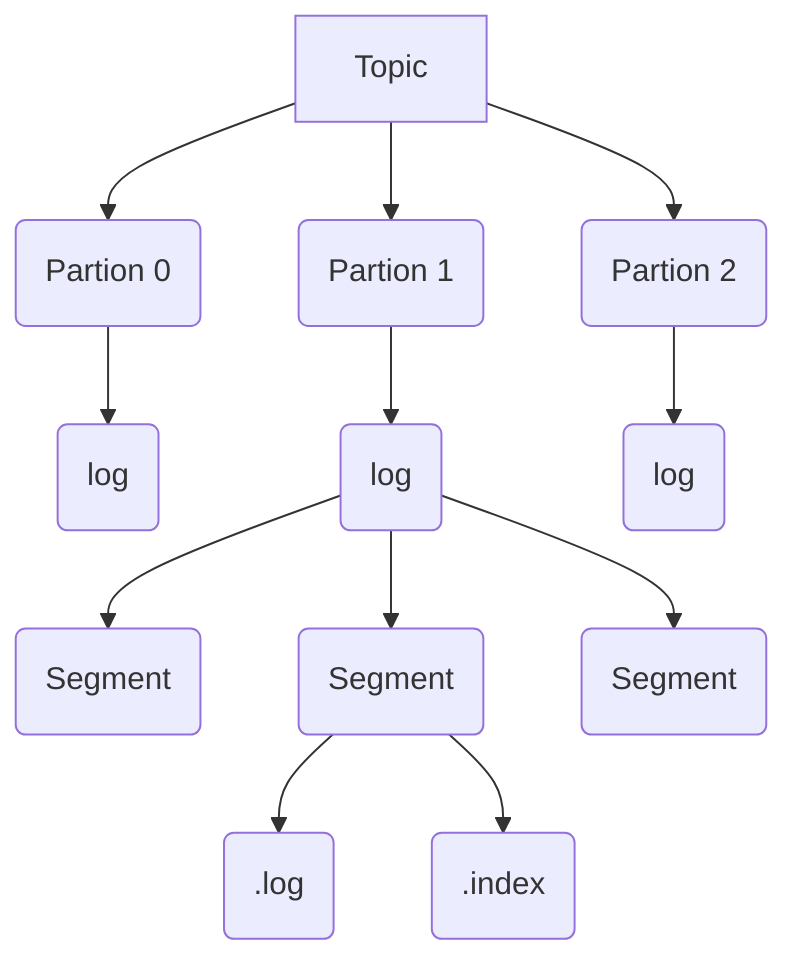

<!---
markmeta_author: wongoo
markmeta_date: 2021-09-26
markmeta_title: kafka
markmeta_categories: MQ
markmeta_tags: kafka,mq
-->

# kafka

## 1. 概念 concepts

- Broker: 消息中间件处理节点（服务器），一个节点就是一个broker，一个Kafka集群由一个或多个broker组成
- Topic: Kafka对消息进行归类，发送到集群的每一条消息都要指定一个topic
- Partition: 物理上的概念，每个topic包含一个或多个partition，一个partition对应一个文件夹，这个文件夹下存储partition的数据和索引文件，每个partition内部是有序的
- Producer: 生产者，负责发布消息到broker
- Consumer: 消费者，从broker读取消息
- ConsumerGroup: 每个consumer属于一个特定的consumer group，可为每个consumer指定group name，若不指定，则属于默认的group，一条消息可以发送到不同的consumer group，但一个consumer group中只能有一个consumer能消费这条消息
- Replica: 副本，为实现备份的功能，保证集群中的某个节点发生故障时，该节点上的 Partition 数据不丢失，且 Kafka 仍然能够继续工作，Kafka 提供了副本机制，一个 Topic 的每个分区都有若干个副本，一个 Leader 和若干个 Follower。
- Leader: 每个分区多个副本的“主”副本，生产者发送数据的对象，以及消费者消费数据的对象，都是 Leader。
- Follower: 每个分区多个副本的“从”副本，实时从 Leader 中同步数据，保持和 Leader 数据的同步。Leader 发生故障时，某个 Follower 还会成为新的 Leader。
- Offset: 消费者消费的位置信息，监控数据消费到什么位置，当消费者挂掉再重新恢复的时候，可以从消费位置继续消费。
- cluster manager： 集群管理器, Kafka 集群能够正常工作，需要依赖于一致性协调框架，3.0版本之前使用Zookeeper，3.0版本开始使用自己实现的raft协议框架，主要负责存储和管理集群信息。

## 2. 关系

### 2.1 Topic & Partition

* 一个topic为一类消息，每条消息必须指定一个topic。
* 物理上，一个topic分成一个或多个partition，每个partition有多个副本分布在不同的broker中

### 2.2 Consumer Group & Consumer

* 一个 Consumer Group 由一个或多个 Consumer 实例组成，便于扩容与容错。
* kafka是发布与订阅模式，这个订阅者是 Consumer Group，而不是 Consumer 实例。
* 每一条消息只会被同一个 Consumer Group 里的一个 Consumer 实例消费，不同的 Consumer Group 可以同时消费同一条消息

## 3. 存储

* 一个topic对应多个patition, 每个partition有自己的副本.
* 一个partition对应多个日志, 每个日志按照 Segment 段进行存储
* 每个 Segment 段包含一个 `.log` 日志文件 和 一个 `.index` 索引文件

### 3.1 append log

* 每个partition在存储层面是一个append log文件，发布到此partition的消息会追加到log文件的尾部，为顺序写人磁盘。每条消息在log文件中的位置成为offset（偏移量），offset为一个long型数字，唯一标记一条消息。
* 每个消费者唯一保存的元数据是offset值，这个位置完全为消费者控制，因此消费者可以采用任何顺序来消费记录；
* 只能保证partition中记录是有序的，而不保证topic中不同partition的顺序

### 3.2 删除数据

提供两种策略:
1. 基于时间，让kafka删除2天或一周的数据；
2. 基于partition文件大小：让kafka在partition文件超过1GB时删除数据；

## 4. 特性

### 4.1 exactly once

kafka保证同一个消费组里只有一个消费者会消费一条消息。

### 4.2 consumer reblance

* 某个partition的数据只会被某一特定的consumer实例消费
* 每个consumer不用跟大量的broker通信，减少通信开销，也降低了分配难度
* 同一个partition数据是有序的，保证了有序被消费

根据consumer group中的consumer数量和partition数量，可以分为以下3种情况：

* 若consumer group中的consumer数量少于partition数量，则至少有1个consumer会消费多个partition数据
* 若consumer group中的consumer数量多于partition数量，则会有部分consumer无法消费该topic中任何一条消息
* 若consumer group中的consumer数量等于partition数量，则正好一个consumer消费一个partition数据

## A. Reference

- Kafka架构图, https://zhuanlan.zhihu.com/p/38269875

## History

- 2021-09-26, first version

