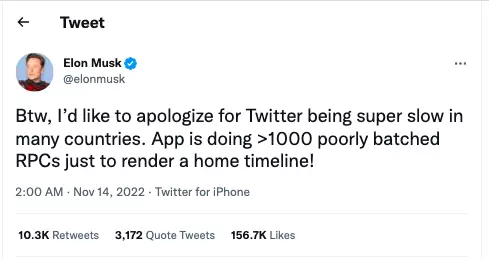
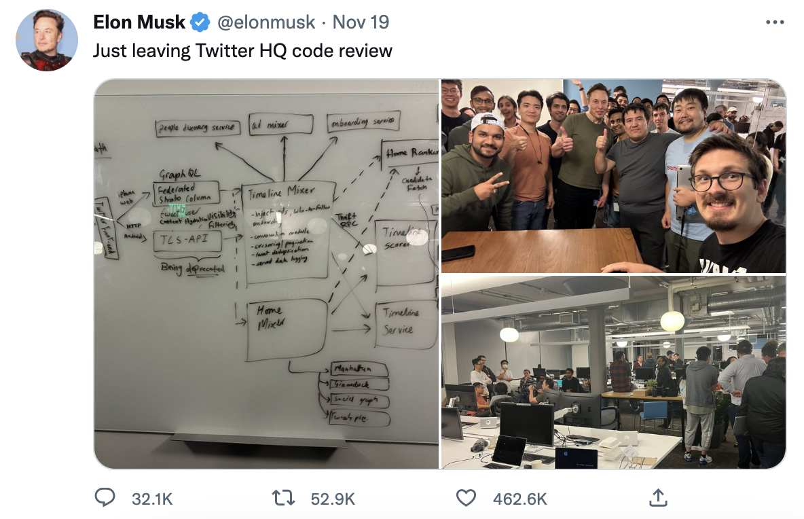
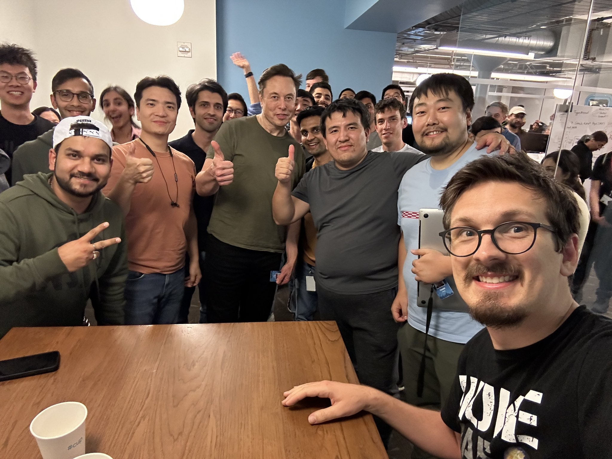
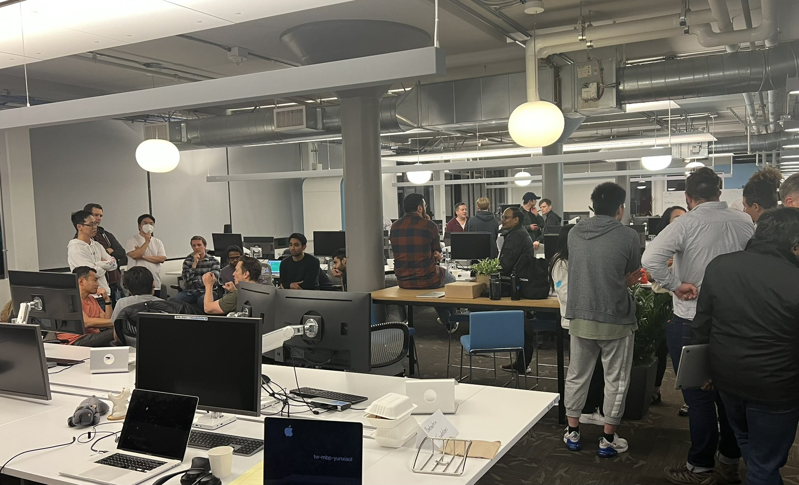
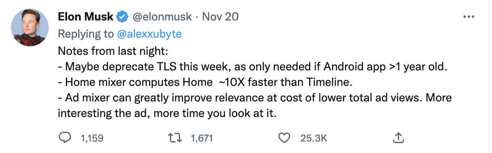

<!---
markmeta_author: 斜风
markmeta_date: 2022-11-22
markmeta_title: 马斯克改造推特
markmeta_categories: 思考
markmeta_tags: think
-->

# 马斯克改造推特

马斯克收购twitter之后，就进行了大批量的裁员，并开始梳理twitter的整改业务流程，
参与 code review，优化系统功能，提升速度，增强安全。

马斯克说: "身为 Twitter 的新掌门人，马斯克于上周日发推称“首先为 Twitter 在很多国家的超慢速度道歉。
Twitter App 在渲染主页时间线时，会执行 1000 多个性能低下的批量 RPC."
有工程师们开始职责马斯克不懂技术，说RPC次数没那么多，这些RPC也不是客户端的请求数，而是微服务请求数。
也有工程师指出：“在我看来，Twitter 应用运行缓慢有三个原因。首先，其中包含大量极少使用的功能，导致软件过于臃肿；
其次，我们多年以来积累了大量技术债务，所以被迫在速度和功能之间求取平衡；第三，还有很大一部分延迟是网络响应造成的。”

马斯克梳理系统架构到深夜，并与工程师们合影。

马斯克参与讨论系统架构白板图。

马斯克与工程师合影。

马斯克与工程师讨论。

马斯克回复一些具体的系统优化点。

马斯克在用 [第一性原理](https://tiltwind.com/blog/2017/2017-04-02-first-principle) 重新梳理 twitter 的系统架构，
探索极致性能，优化成本。

**马斯克的思路是从全局到细节，识别对整体影响较大的部分，对其进行优化改进。也同时思考构成部分是否是必要的，是否可以用去掉或用其他方案替代。**

如果工程师只片面从代码细节考虑问题，可能认为马斯克是不懂技术的，是瞎指挥。
要理解老板的思路，更多要从经济效益的角度思考，用经济效益结果来证明方案的可行性。

## 参考

1. 马斯克开始“整顿”臃肿技术架构？https://www.infoq.cn/article/Gw50bZHLrreF9GAVJJDc
